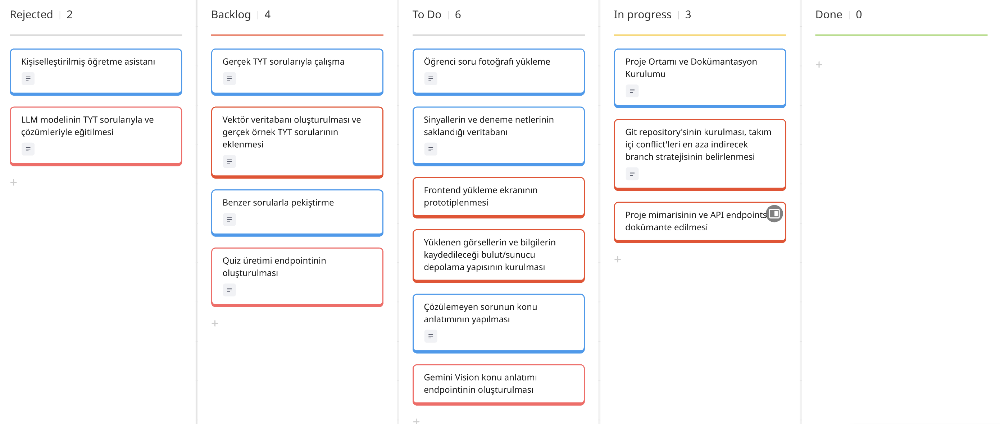
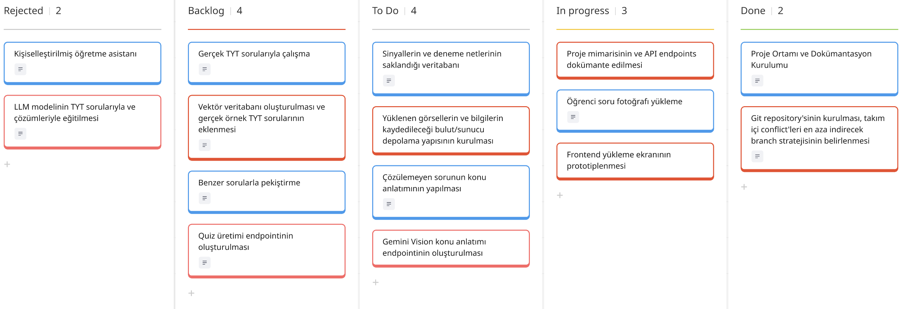
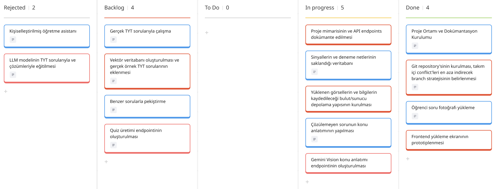
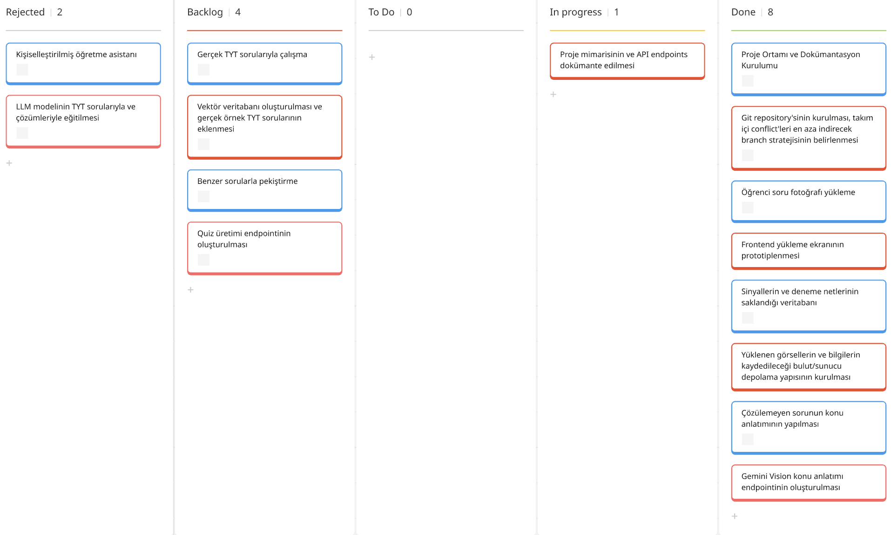
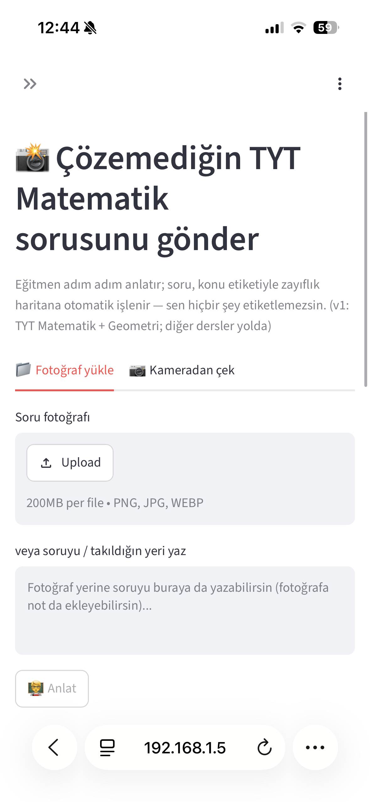
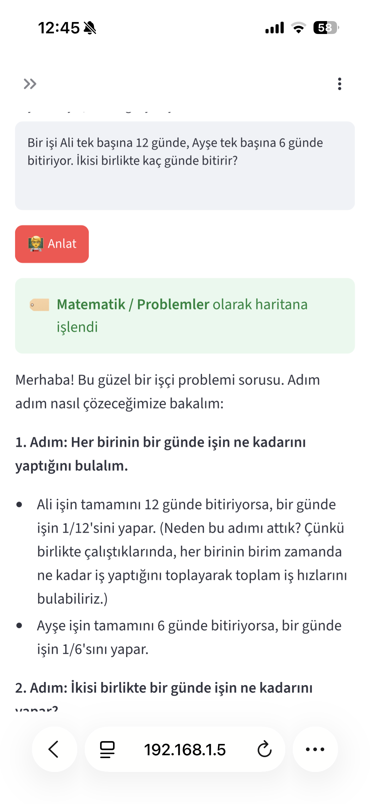
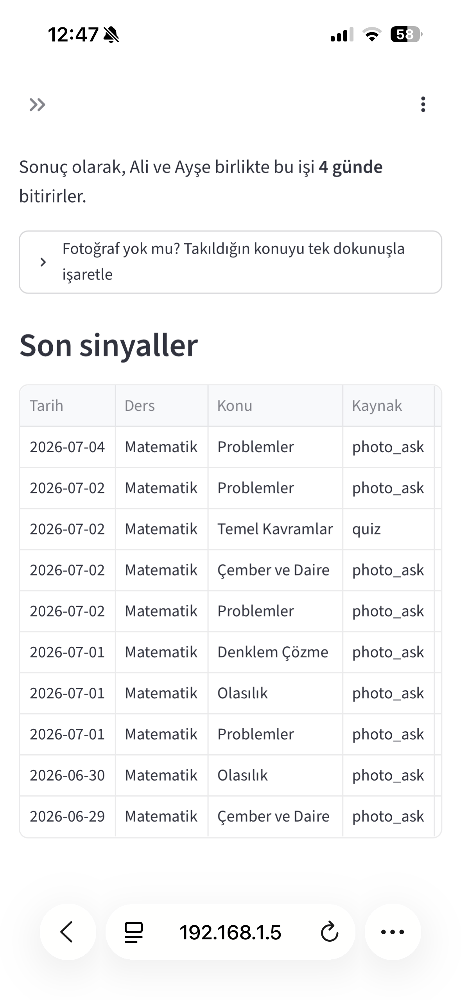
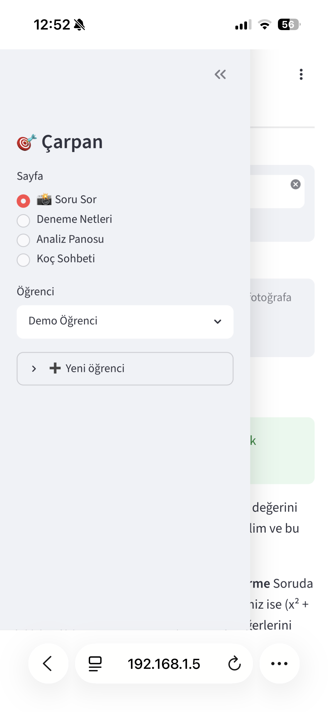
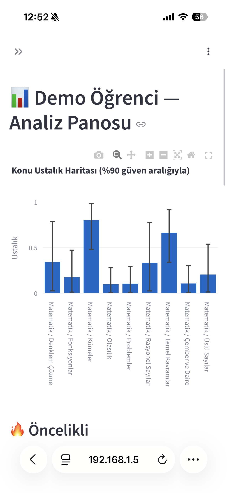
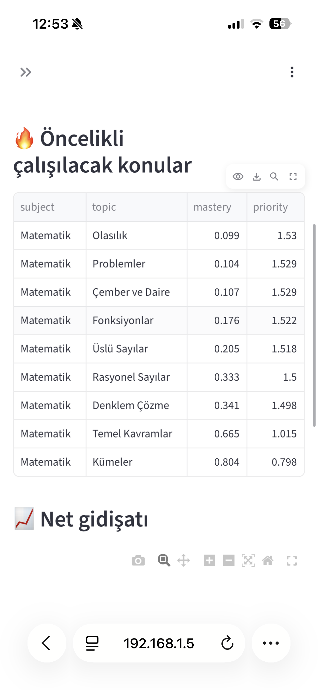

# **Takım İsmi**

Takım 76

# Ürün İle İlgili Bilgiler

## Takım Elemanları

- Emir Arda Tomaç: Product Owner
- Bahar Çakır: Scrum Master
- Görkem Çetinkaya: Team Member/Developer
- Doğa Alışkan: Team Member/Developer
- Ece Nur Şahin: Team Member/Developer

## Ürün İsmi

--TYT Koçum--

## Ürün Açıklaması

- TYT Koçum uygulaması, YKS dönemindeki öğrencilere destek amacıyla oluşturulmuş ve öğrencilerin takıldıkları soruları atıp yardım alabileceği, zayıf noktalarını belirleyebileceği ve kişiselleştirilmiş bir anlatıma olanak sağlayan bir uygulamadır.

## Ürün Özellikleri

- Soru fotoğraflarından adım adım soru çözümü
- Anlatımlardan sonra pekiştirmek amaçlı benzer soru çözümü
- Çözülemeyen sorulardan oluşturulan zayıflık haritası
- Haftalık kişisel çalışma planı
- Gelecek denemelerdeki başarı tahminleri
- AI koçuyla konuşabilme 

## Hedef Kitle

- YKS'ye hazırlanan öğrenciler
- Deneme netlerini arttırmak isteyen öğrenciler
- 15-25 yaş arası kullanıcılar

## Product Backlog URL

[Miro Backlog Board](https://miro.com/app/board/uXjVH-ttQY8=/?share_link_id=525660778806)

---

# Sprint 1

- **Backlog düzeni ve Story seçimleri**: Backlog'umuz ilk yapılacak story'lere göre düzenlenmiştir. Sprint başına tahmin edilen puan sayısını geçmeyecek şekilde sıradan seçimler yapılmaktadır. Story başına çıkan tahmin puanı, toplam puanın yarısından az tutulmuştur. 

Story'ler yapılacak işlere (task'lere) bölünmüştür. Miro Board'da gözüken kırmızı item'lar yapılacak işleri (task) gösterirken, mavi item'lar story'leri temsil etmektedir.

- **Daily Scrum**: Daily Scrum toplantılarının zamansal sebeplerden ötürü Slack üzerinden yapılmasına karar verilmiştir. Daily Scrum toplantısı örneği jpeg veya word olarak Readme'de tarafımızdan paylaşılmaktadır: [Sprint 1 Daily Scrum Chats](https://github.com/OyunveUygulamaAkademisi/BootcampScrumTemplate/blob/main/ProjectManagement/Sprint1Documents/DailyScrumMeetingNotesSprint1.docx?raw=true)

- **Sprint board update**: Sprint board screenshotları: 

- **Ürün Durumu**: Ekran görüntüleri:
  
  
  
  
  
  
  

- **Sprint Review**: 
Alınan kararlar: Veritabanı için gerekli olan TYT örnek sorularının toplanması gerekmektedir. Kişiselleştirilmiş öğrenme asistanı için fine-tuning işlemine gerek olmadığına ve aynı sonucun Gemini API ve RAG yöntemiyle ulaşılabileceğine karar verilmiştir.

- **Sprint Retrospective:**
  - Takım içindeki görev dağılımıyla ilgili düzenleme yapılması kararı alınmıştır
  - Makine öğrenmesi modellerinin eğitimiyle ilgili tüm ekip üyelerinin araştırma yapması kararı alınmıştır

---

# Sprint 2

---

# Sprint 3

---
