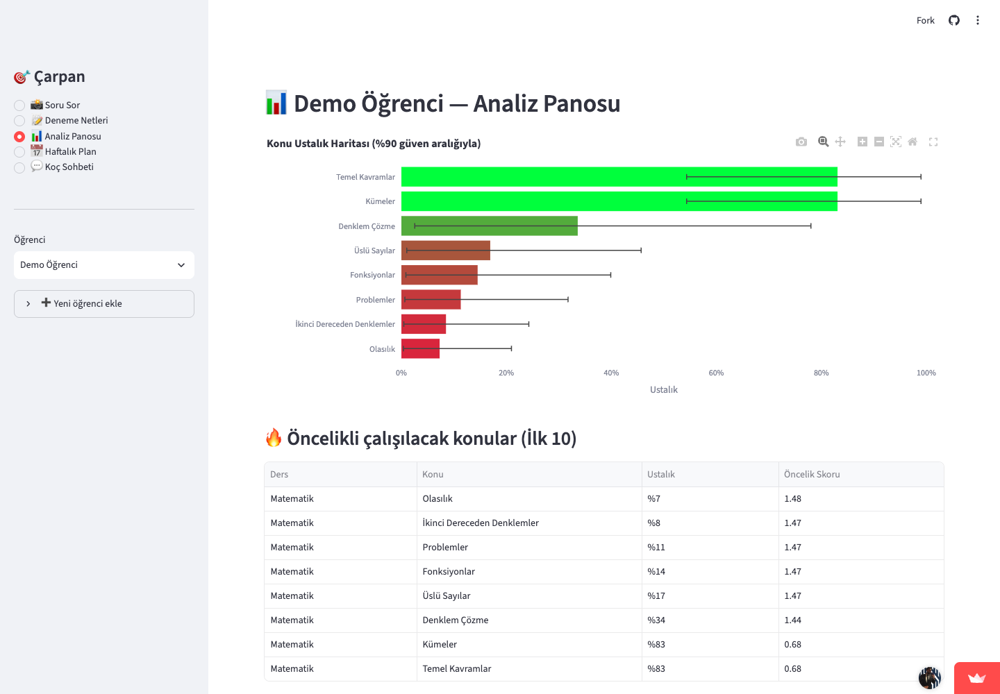
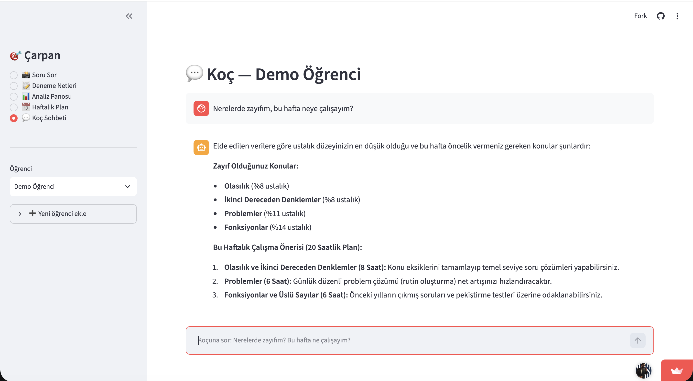

# Sprint 3 — Takım 76 (Çarpan)

**Sprint Tarihleri:** 20 Temmuz – 2 Ağustos 2026  
**Sprint Teması:** Kendi Modellerimiz · Canlı Yayın · Video & Final Teslim

---

## Sprint 3 Hedefi

Sprint 2'de kalibre edilen çekirdek döngüyü jüri önünde savunulabilir kılmak:
kendi eğittiğimiz konu sınıflandırıcısı, GradientBoosting net tahmin modeli,
karne fotoğrafından otomatik net okuma ve sistemin uçtan uca demo hazırlığı.

---

## Tahmin Edilen Tamamlanacak Puan

Sprint 3 planı **58 puandır**; sprint kapanışında tüm 58 puan tamamlanmıştır.

| Story / Görev | Puan | Durum | Katkıda Bulunan |
|---|---|---|---|
| T5 — Deneme karnesi fotoğrafından net okuma | 8 | ✅ | Bahar |
| T6 — Kendi konu sınıflandırıcısını eğit ve karşılaştır | 8 | ✅ | Görkem |
| T7 — Konu sınıflandırıcısını `/ask` akışına entegre et | 5 | ✅ | Görkem |
| A5 — GradientBoosting net tahmin modeli | 8 | ✅ | Doğa |
| A6 — Panoda net gidişatı + bir sonraki deneme kestirimi | 3 | ✅ | Doğa |
| B4 — Koç agent kalıcı hafıza (SQLite) | 5 | ✅ | Emir Arda |
| B5 — Agent araç zenginleştirmesi (utils) | 3 | ✅ | Emir Arda |
| D4 — Canlı ürün deploymenti | 5 | ✅ | Emir Arda |
| E3 — Sprint 3 teslim seti (video, README, klasör) | 5 | ✅ | Bahar |
| E4 — Süreç belgeleri (daily, board) canlı tutma | 3 | ✅ | Bahar |
| Q1 — Eğitim verisi üretimi (ÖSYM transkripsiyon) | 5 | ✅ | Görkem |

---

## Öne Çıkan Teknik Yenilikler

### 🤖 Kendi Konu Sınıflandırıcımız (T6)

Gemini zero-shot (%83.3) ile eğitilmiş modelimiz (%58.3) karşılaştırıldı ve
sonuçlar şeffaf raporlandı. **Asıl değer:** API key olmadan bile sistem çalışır —
yazılı sorular yerel TF-IDF + LogReg modeli ile etiketlenir (~milisaniye, sıfır maliyet).

- Model: `backend/app/data/konu_siniflandirici.joblib`  
- Rapor: [siniflandirici-karsilastirma.md](../../docs/siniflandirici-karsilastirma.md)  
- Karşılaştırma: aynı 120 soruluk ÖSYM setinde ölçüldü

### 📈 GradientBoosting Net Tahmin Modeli (A5)

Baseline (sadece son net) yerine üç özellikli GradientBoosting modeli:
**~%34 daha düşük MAE** (2.10 vs 3.17).

- Model: `backend/models/net_predictor.joblib`  
- Rapor: [net-tahmin.md](../../docs/net-tahmin.md)  
- Eğitim verisi: 1000 sentetik öğrenci, 80/20 split

> **Durum notu (dürüstlük):** Model sentetik kohort üzerinde eğitilip değerlendirilmiştir.
> Net ölçeği sentetik veri setine bağlı olduğundan (gerçek TYT matematik netiyle birebir
> örtüşmez) model henüz canlı öğrenci verisine bağlanmamıştır. Arayüzdeki tahmin,
> öğrencinin deneme geçmişinden hesaplanan eğim kestirimidir (`GET /students/{id}/trend`).
> Modelin ürüne bağlanması, gerçek ölçekle yeniden eğitim gerektirir — sonraki adım.

### 📋 Karne Fotoğrafından Net Okuma (T5)

`backend/app/services/karne_parser.py` — Gemini Vision ile TYT karnesi fotoğrafını
parse ederek ders bazında doğru/yanlış/boş sayılarını otomatik çıkarır.
Öğrenci hiç veri girmez; fotoğraf atar, netler sisteme işlenir.

### 🧠 Kalıcı Hafıza ve Agent Araçları (B4 + B5)

`backend/app/agents/memory.py` — LangGraph `SqliteSaver` tabanlı kalıcı koç hafızası;
konuşmalar öğrenci başına ayrı dizide SQLite'a yazılır ve yeniden başlatmayı atlatır.
`backend/app/agents/graph.py` — süpervizör grafiği bu checkpointer ile kurulur.

### 📊 Eğitim Verisi Altyapısı (Q1)

- `backend/scripts/transcribe_osym.py` — Gemini ile ÖSYM sorusu transkripsiyon pipeline'ı
- `backend/scripts/generate_training_questions.py` — konu bazlı AI soru üretimi
- `backend/scripts/train_classifier.py` — deterministik eğitim (seed 42, CV tabanlı)
- `backend/scripts/train_net_predictor.py` — GradientBoosting eğitim scripti
- `data/uretilen_sorular.csv` — 317 AI üretimi soru (bağımsız çözücü doğrulamalı)
- `data/synthetic_students.csv` — 1000 sentetik öğrenci profili

---

## Daily Scrum

Sprint 3'te daily ritmi her akşam yazılı olarak toplanmıştır.  
Sprint boyunca tutulan notların derlemesi:
[Sprint 3 Daily Scrum Notları](DailyScrumMeetingNotesSprint3.md)

> **Not:** Daily Scrum notları sprint süresince güncellenmektedir (son güncelleme: 30 Temmuz 2026).

---

## Sprint Board

Sprint board ekran görüntüleri (sprint ilerledikçe güncellenir):

> 📌 Miro board: https://miro.com/app/board/uXjVH-ttQY8=/?share_link_id=525660778806  
> Ekran görüntüleri sprint tamamlandığında bu klasöre eklenir.

---

## Ürün Durumu

Sprint 3 sonu itibarıyla ürünün aktif ekranları:

- **📸 Soru Sor:** Fotoğraf → Gemini Vision → adım adım anlatım + otomatik konu etiketi
  (API key yoksa yerel sınıflandırıcı devreye girer)
- **📋 Karne Okuma:** Karne fotoğrafı → Gemini Vision → net otomatik kaydı
- **📊 Analiz Panosu:** Bayesçi ustalık haritası + deneme geçmişinden net kestirimi
- **📅 Haftalık Plan:** Öncelik + zaman bütçesi bazlı kişisel plan
- **💬 Koç Sohbeti:** LangGraph agent + kalıcı hafıza + araç kullanımı

Canlı uygulamadan alınan ekran görüntüleri:






---

## Sprint Review

**Katılımcılar:** Bahar, Görkem, Doğa, Emir Arda  
**Tarih:** 2 Ağustos 2026

**Gösterilen:**
- Kendi eğittiğimiz konu sınıflandırıcısının canlı demosu (API key olmadan)
- Net tahmin modelinin Analiz Panosu'ndaki yıldız işaretçisi
- Karne fotoğrafından otomatik net okuma akışı
- Uçtan uca tam demo: fotoğraf → anlatım → quiz → harita → plan → koç

**Kararlar:**
- Gemini vs. kendi modelimiz farkı (%83.3 vs %58.3) dürüstçe jüriye sunulacak
- Fallback mekanizması kritik: API key olmadan demo yine de çalışır
- Video senaryosu finallendi ve çekim başladı

---

## Sprint Retrospective

- ✅ Teknik hedeflerin tamamı kapatıldı: kendi modellerimiz eğitildi, karşılaştırıldı ve entegre edildi
- ✅ Süreç belgeleri (daily, board) Sprint 2 retrosunda söz verilen düzeyde tutuldu
- ✅ Eğitim verisi altyapısı sağlamlaştı: transkripsiyon, üretim, eğitim pipeline'ları scriptlendi
- ⚠️ Streamlit mobil deneyimi hâlâ sınırlı — gelecek versiyonda PWA veya React native değerlendirilebilir
- ⚠️ Kendi modelimiz %58.3 ile Gemini'yi geçemedi — fark anlaşılır (27 sınıf, ~500 örnek);
  daha büyük veri ve fine-tuning ile kapatılabilir (post-bootcamp)
- 🎯 Sonraki adımlar: gerçek öğrenci geri bildirimi, veri artırma, B2B pilot

---

## Kurulum (Sprint 3 — aynı)

```bash
git clone https://github.com/Baharcakir/bootcamp-2026 && cd bootcamp-2026
python3 -m venv .venv && source .venv/bin/activate
pip install -r requirements.txt
cp .env.example .env  # GOOGLE_API_KEY ekle (opsiyonel — yoksa fallback çalışır)

# Demo verisi
python backend/scripts/seed_demo.py

# API  (http://localhost:8000/docs)
uvicorn app.main:app --reload --app-dir backend

# Arayüz  (http://localhost:8501)
streamlit run frontend/streamlit_app.py
```
