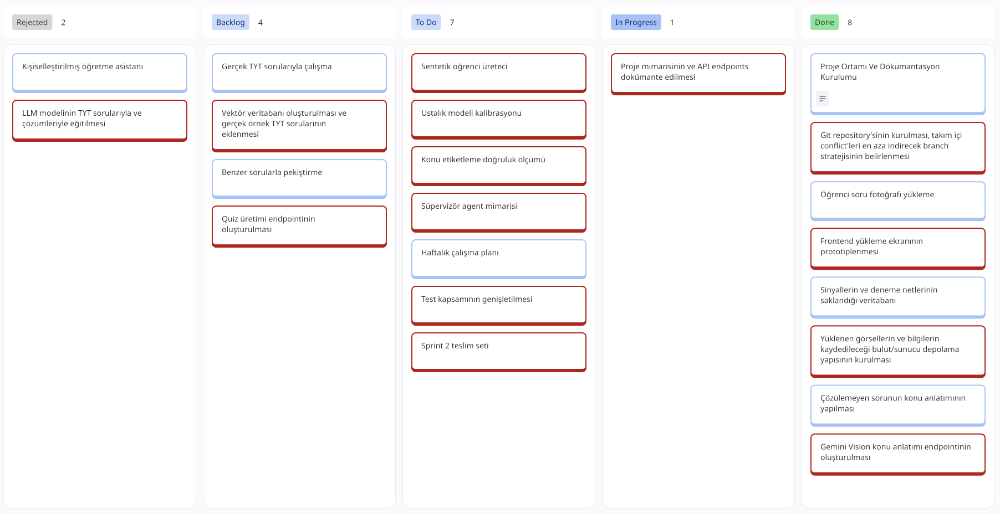
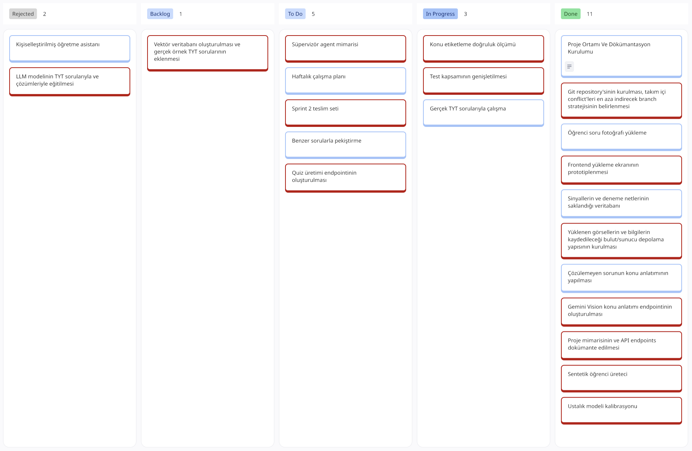
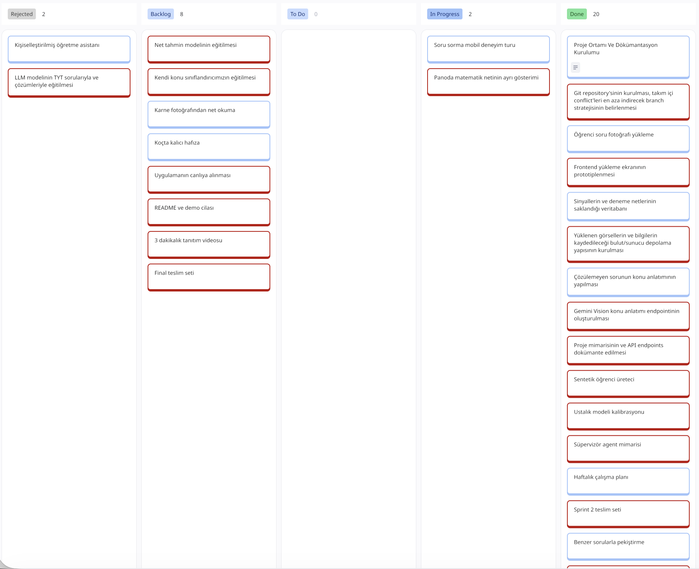
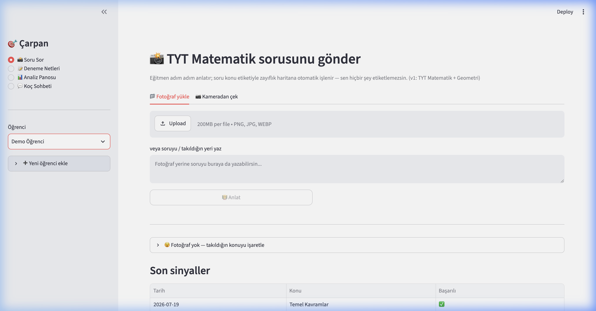
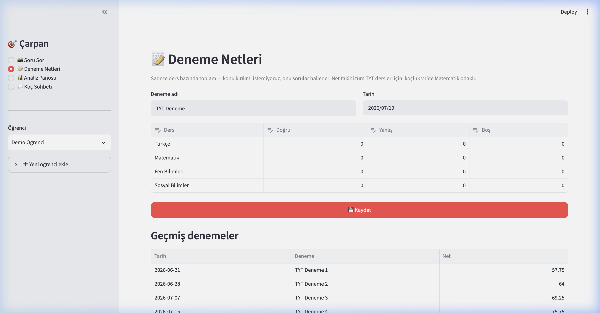
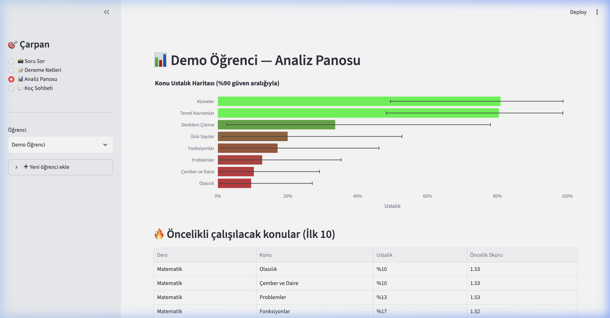
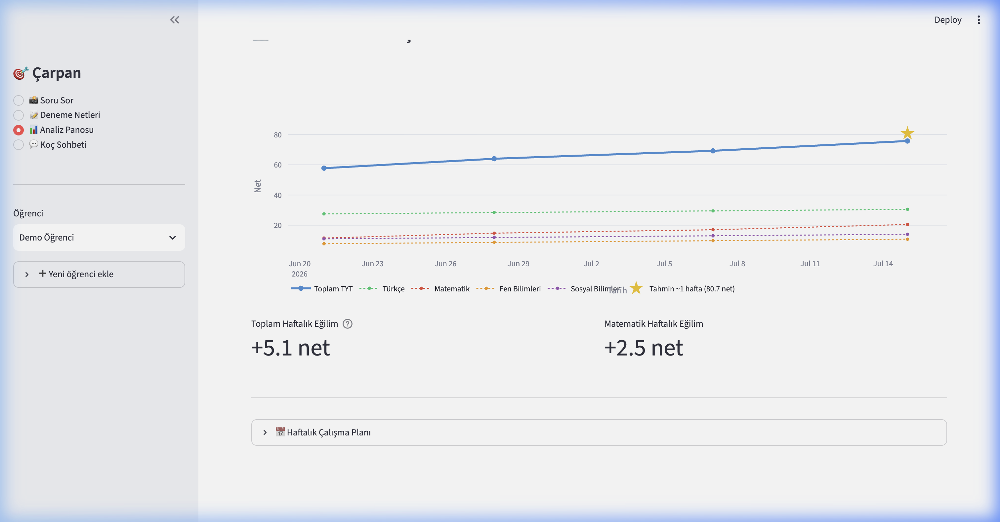
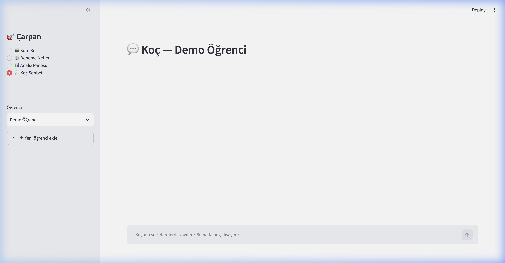

# **Takım İsmi**

Takım 76

# Ürün İle İlgili Bilgiler

## Takım Elemanları

- Emir Arda Tomaç: Product Owner
- Bahar Çakır: Scrum Master
- Görkem Çetinkaya: Team Member/Developer
- Doğa Alışkan: Team Member/Developer
- Ece Nur Şahin: Team Member/Developer *(19 Temmuz 2026'da bootcamp'ten ayrıldı)*

## Ürün İsmi

--Çarpan--

## Ürün Açıklaması

- Çarpan uygulaması, YKS dönemindeki öğrencilere destek amacıyla oluşturulmuş ve öğrencilerin takıldıkları soruları atıp yardım alabileceği, zayıf noktalarını belirleyebileceği ve kişiselleştirilmiş bir anlatıma olanak sağlayan bir uygulamadır.

## Ürün Özellikleri

- Soru fotoğraflarından adım adım soru çözümü
- Anlatımlardan sonra pekiştirmek amaçlı benzer soru çözümü
- Çözülemeyen sorulardan oluşturulan zayıflık haritası
- Haftalık kişisel çalışma planı
- Gelecek denemelerdeki başarı tahminleri
- AI koçuyla konuşabilme 

## Hedef Kitle

- YKS'ye hazırlanan öğrenciler
- Deneme netlerini arttırmak isteyen öğrenciler
- 15-25 yaş arası kullanıcılar

## Product Backlog URL

[Miro Backlog Board](https://miro.com/app/board/uXjVH-ttQY8=/?share_link_id=525660778806)

---

# Sprint 1

- **Backlog düzeni ve Story seçimleri**: Backlog'umuz ilk yapılacak story'lere göre düzenlenmiştir. Sprint başına tahmin edilen puan sayısını geçmeyecek şekilde sıradan seçimler yapılmaktadır. Story başına çıkan tahmin puanı, toplam puanın yarısından az tutulmuştur. 

Story'ler yapılacak işlere (task'lere) bölünmüştür. Miro Board'da gözüken kırmızı item'lar yapılacak işleri (task) gösterirken, mavi item'lar story'leri temsil etmektedir.

- **Daily Scrum**: Daily Scrum toplantılarının zamansal sebeplerden ötürü Slack üzerinden yapılmasına karar verilmiştir. Daily Scrum toplantısı örneği jpeg veya word olarak Readme'de tarafımızdan paylaşılmaktadır: [Sprint 1 Daily Scrum Chats](https://github.com/OyunveUygulamaAkademisi/BootcampScrumTemplate/blob/main/ProjectManagement/Sprint1Documents/DailyScrumMeetingNotesSprint1.docx?raw=true)

- **Sprint board update**: Sprint board screenshotları: 

- **Ürün Durumu**: Ekran görüntüleri:
  
  
  
  
  
  
  

- **Sprint Review**: 
Alınan kararlar: Veritabanı için gerekli olan TYT örnek sorularının toplanması gerekmektedir. Kişiselleştirilmiş öğrenme asistanı için fine-tuning işlemine gerek olmadığına ve aynı sonucun Gemini API ve RAG yöntemiyle ulaşılabileceğine karar verilmiştir.

- **Sprint Retrospective:**
  - Takım içindeki görev dağılımıyla ilgili düzenleme yapılması kararı alınmıştır
  - Makine öğrenmesi modellerinin eğitimiyle ilgili tüm ekip üyelerinin araştırma yapması kararı alınmıştır

---

# Sprint 2

- **Sprint Notları**: Sprint hedefi, ürünün çekirdek döngüsünü uçtan uca kapatmak ve kalitesini ölçmekti: soru fotoğrafından adım adım anlatım + otomatik konu etiketi, MEB kazanımına dayalı kaynak gösterimi ve benzer çıkmış soru önerisi, doğrulanmış mini quiz, sentetik öğrenci verisiyle kalibre edilen ustalık modeli, süpervizör agent mimarisi ve haftalık çalışma planı. Sprint başında işler kişi başına görev paketleri halinde dağıtılmış; sprint ortasında kod işbirliği dal + Pull Request + gözden geçirme düzenine geçirilmiştir (PR #1, PR #2). Ayrıntılı uygulama notları: [Sprint 2 detay raporu](Sprint2/Takım76-Sprint2-README.md)

- **Takım Değişikliği**: Ece Nur Şahin sprint sonunda bootcamp'ten ayrılmıştır; durum akademiye Scrum Master tarafından bildirilmiştir ve takım 4 kişiyle devam etmektedir. Ayrılan üyenin süreç işleri Görkem'e, arayüz işleri Bahar'a devredilmiştir.

- **Tahmin Edilen Tamamlanacak Puan**: Sprint 2 planı 64 puandır; sprint kapanışında tüm 64 puan tamamlanmıştır.

| Story | Puan | Durum | Katkıda Bulunan |
|---|---|---|---|
| T2 — Kaynaklı anlatım (MEB kazanımı + çıkmış soru önerisi) | 8 | ✅ | Görkem |
| T3 — Doğrulanmış quiz + ustalık güncelleme döngüsü | 8 | ✅ | Görkem |
| T4 — ÖSYM değerlendirme seti + doğruluk raporu | 5 | ✅ | Görkem |
| A3 — Sentetik öğrenci üreteci | 8 | ✅ | Doğa |
| A4 — Ustalık modeli kalibrasyonu | 8 | ✅ | Doğa |
| B2 — Süpervizör agent mimarisi | 5 | ✅ | Emir Arda |
| B3 — Haftalık çalışma planı | 8 | ✅ | Emir Arda |
| D3 — Test kapsamının genişletilmesi (12 → 30 test) | 4 | ✅ | Görkem |
| E2 — Sprint 2 teslim seti | 2 | ✅ | Görkem |
| C2 — Soru sorma mobil deneyim turu + quiz arayüzü | 3 | ✅ | Bahar |
| C3 — Panoda ders bazlı net gidişatı + pano cilası | 5 | ✅ | Bahar |

- **Öne Çıkan Ölçüm**: Otomatik konu etiketleme, 120 gerçek ÖSYM sorusundan (2024-2026 TYT) oluşan elle etiketli sette ölçülmüştür; uyuşmazlık denetimi ve prompt'a eklenen tutarlılık kurallarıyla doğruluk **%76.7 → %80.8 → %83.3** olarak iyileştirilmiştir. Yöntem, sistematik hata analizi ve denetim izleri: [etiketleme doğruluk raporu](../docs/etiketleme-dogruluk-raporu.md)

- **Daily Scrum**: Bu sprintte daily ritmi düzenli işlememiş, koordinasyon büyük ölçüde Pull Request açıklamaları ve birebir mesajlaşma üzerinden yürümüştür; bu durum retrospektifte iyileştirme maddesi olarak ele alınmıştır. Sprint boyunca tutulan notların derlemesi: [Sprint 2 Daily Scrum Notları](Sprint2/DailyScrumMeetingNotesSprint2.docx)

- **Sprint board update**: Sprint board screenshotları:

- **Ürün Durumu**: Ekran görüntüleri (soru sorma akışı, deneme neti girişi, konu bazlı renk gradyanlı ustalık haritası, ders bazlı net gidişatı ve haftalık plan). 30 otomatik test + lint her push'ta GitHub Actions üzerinde koşmaktadır.

  
  
  
  
  

- **Sprint Review**: 
Canlı demo: soru fotoğrafı → anlatım → quiz → zayıflık haritasının güncellenişi → koçtan haftalık plan. Doğruluk raporunun sunumu (%83.3) ve Sprint 3 önceliklendirmesi planlanmıştır.
Katılımcılar: Bahar, Görkem, Doğa, Emir Arda
Alınan kararlar: API key olmadan ürünün demo modunda çalışmaya devam etmesi jüri sunumu için kritik olduğu görülmüştür ve fallback mekanizması hayata geçirilmiştir. Subject trend endpoint generic yazıldı — ilerleyen sprintlerde yeni ders eklenmesi halinde kod değişmeyecek.

- **Sprint Retrospective:**
  - Teknik hedeflerin tamamı kapatılmış, ölç → iyileştir → doğrula döngüsü kanıtıyla tamamlanmıştır
  - Dal + Pull Request + gözden geçirme kültürü kurulmuştur; test kapsamı 12'den 30'a çıkmıştır
  - Süreç belgeleri (daily, board) kodun gerisinde kalmıştır; Sprint 3'te board ve daily sorumlusu Bahar olacak, her akşam kısa yazılı daily tutulacaktır
  - Görev sahiplenmedeki boşlukların erken konuşulması kararlaştırılmıştır
  - Streamlit'in mobil deneyimi sınırlı kalmaktadır; Sprint 3'te PWA veya farklı frontend framework değerlendirilebilir

---

# Sprint 3

---