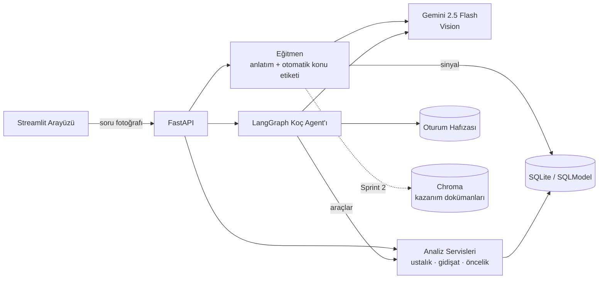

<div align="center">

# 🎯 Çarpan

### TYT Matematik netini yükselten yapay zeka koçu

**Çözemediğin matematik sorusunun fotoğrafını at, anında adım adım anlatım al.** Her sorduğun
soru, yapay zeka tarafından otomatik konu etiketlenir ve zayıflık haritan **kendiliğinden**
oluşur — veri girişi yok, form yok. Harita + deneme netlerinle koçun sana kişisel haftalık
plan çıkarır.

*Önce değer, sonra veri. · v1: TYT Matematik · YZTA Bootcamp 2026 · Yapay Zeka & Veri Bilimi*

</div>

---

## 👥 Takım

<!-- TODO: İsimleri, rolleri ve profilleri doldurun (5 kişi: 1 PO, 1 SM, 3 Developer) -->

| İsim | Rol | GitHub |
|---|---|---|
| [AD SOYAD] | Product Owner | [profil] |
| [AD SOYAD] | Scrum Master | [profil] |
| [Doğa Alışkan] | Developer | [profil] |
| [AD SOYAD] | Developer | [profil] |
| [AD SOYAD] | Developer | [profil] |

**Takım ismi:** [TAKIM İSMİ]

## 🧠 Ürün Açıklaması

Soru çözüm uygulamaları soruyu anlatır ama öğrenciyi tanımaz; koçluk hizmetleri öğrenciyi tanır
ama pahalıdır. "Analiz" araçları ise öğrenciden ödev gibi veri girişi ister — kimse girmez.

Çarpan'ın çekirdek döngüsü bu üç problemi birden çözer: öğrenci **takıldığı matematik sorusunun
fotoğrafını atar**, eğitmen yapay zeka **adım adım anlatır** (değer anında verilir) ve aynı anda
soruyu 26 konuluk TYT Matematik taksonomisine göre **otomatik konu etiketleyip** zayıflık sinyali
olarak kaydeder. Sinyaller biriktikçe Bayesçi ustalık haritası, konu öncelikleri ve haftalık plan
kendiliğinden oluşur. Denemelerden yalnızca ders bazında toplam net girilir (4-5 satır, ~10 saniye).

**Anlatım aynı zamanda teşhistir** — analitik, kullanımın yan ürünüdür.

**v1 kapsamı bilinçli olarak TYT Matematik'tir** (en acı nokta, ölçülebilir kalite, 26 konuluk
anlamlı harita); mimari ders-bağımsızdır, taksonomi + korpus ekleyerek genişler. Model eğitim
stratejisi (ÖSYM çıkmış soruları, AI üretimi sorular, sentetik kohortlar): [docs/mimari.md](docs/mimari.md)

Detaylı ürün tanımı: [docs/urun-tanimi.md](docs/urun-tanimi.md)

## ✨ Özellikler

**MVP**
- 📸 Soru fotoğrafı/metni → adım adım anlatım (Gemini Vision) + otomatik konu etiketi
- 🗺️ Kendiliğinden oluşan zayıflık haritası — Bayesçi ustalık skorları, güven aralıklarıyla
- 🔁 Anlatım sonrası mini quiz: doğru cevap ustalığı yukarı günceller (döngü kapanır)
- 📈 Net gidişatı ve gelecek deneme tahmini (10 saniyelik ders-bazlı deneme girişi)
- 🗓️ Kişiye özel haftalık çalışma planı (sınav tarihi, zaman bütçesi, konu öncelikleri)
- 💬 Öğrenciyi hatırlayan yapay zeka koçu (LangGraph agent + araç kullanımı + hafıza)
- 📚 Müfredat kazanımlarına dayalı, kaynak gösteren anlatım (RAG)

**Stretch**
- 📷 Deneme karnesi fotoğrafından net okuma (Gemini Vision)
- ✅ Plan uyum takibi ve otomatik plan revizyonu

## 🎯 Hedef Kitle

- **Birincil:** YKS'ye hazırlanan 11-12. sınıf öğrencileri ve mezunlar; özellikle dershane/koçluk
  hizmetlerine erişimi kısıtlı öğrenciler.
- **İkincil:** Öğrencilerini veriyle takip etmek isteyen öğretmenler ve küçük kurslar (B2B, gelecek aşama).

## 🏗️ Mimari



Detay ve rubrik eşlemesi: [docs/mimari.md](docs/mimari.md)

## 🚀 Kurulum ve Çalıştırma

```bash
# Gereksinim: Python 3.11+
python3 -m venv .venv && source .venv/bin/activate
pip install -r requirements.txt
cp .env.example .env        # GOOGLE_API_KEY girin (soru anlatımı ve koç için)

# Demo verisi (opsiyonel): panoyu dolu görmek için
python backend/scripts/seed_demo.py

# API (http://localhost:8000/docs)
uvicorn app.main:app --reload --app-dir backend

# Arayüz — ayrı terminalde (http://localhost:8501)
streamlit run frontend/streamlit_app.py

# Testler ve lint
pytest backend/tests && ruff check backend frontend
```

## 🗂️ Proje Yönetimi

- **Product Backlog:** [board linki eklenecek]
- **Veri kaynakları ve toplama rehberi:** [docs/veri-kaynaklari.md](docs/veri-kaynaklari.md)
- **Final teslim kontrol listesi:** [docs/teslim-kontrol.md](docs/teslim-kontrol.md)
- **Sprint Board:** [link eklenecek]
- **Daily Scrum:** Her akşam 21:30, 15 dk (WhatsApp/Slack) — notlar sprint klasörlerinde

| Sprint | Tarih | Klasör |
|---|---|---|
| Sprint 1 | 19 Haziran – 5 Temmuz | [Sprint1Documents](ProjectManagement/Sprint1Documents/) |
| Sprint 2 | 6 – 19 Temmuz | [Sprint2Documents](ProjectManagement/Sprint2Documents/) |
| Sprint 3 | 20 Temmuz – 2 Ağustos | [Sprint3Documents](ProjectManagement/Sprint3Documents/) |
