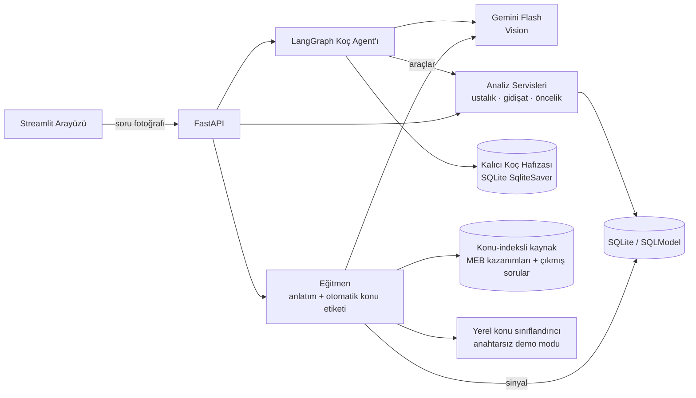

<div align="center">

# 🎯 Çarpan

### TYT Matematik netini yükselten yapay zeka koçu

**Çözemediğin matematik sorusunun fotoğrafını at, anında adım adım anlatım al.** Her sorduğun
soru, yapay zeka tarafından otomatik konu etiketlenir ve zayıflık haritan **kendiliğinden**
oluşur — veri girişi yok, form yok. Harita + deneme netlerinle koçun sana kişisel haftalık
plan çıkarır.

*Önce değer, sonra veri. · v1: TYT Matematik · YZTA Bootcamp 2026 · Yapay Zeka & Veri Bilimi*

</div>

## 🌐 Canlı Uygulama

- **Arayüz:** https://carpan-tyt-kocu.streamlit.app/
- **API:** https://bootcamp-2026-production.up.railway.app
- **API sağlık kontrolü:** https://bootcamp-2026-production.up.railway.app/health
- **API dokümantasyonu:** https://bootcamp-2026-production.up.railway.app/docs

---

## 👥 Takım

| İsim | Rol | GitHub |
|---|---|---|
| Bahar Çakır | Scrum Master · Süreç & Arayüz | [Baharcakir](https://github.com/Baharcakir) |
| Görkem Çetinkaya | Developer · Eğitmen hattı (RAG, quiz, ölçüm) | [gorkem-cetinkaya](https://github.com/gorkem-cetinkaya) |
| Doğa Alışkan | Developer · Modeller & Sentetik Veri | [dogalskn](https://github.com/dogalskn) |
| Emir Arda Tomaç | Product Owner · Agent Mimarisi & Plan | [emirardatomac](https://github.com/emirardatomac) |

**Takım:** Takım 76

## 🧠 Ürün Açıklaması

Soru çözüm uygulamaları soruyu anlatır ama öğrenciyi tanımaz; koçluk hizmetleri öğrenciyi tanır
ama pahalıdır. "Analiz" araçları ise öğrenciden ödev gibi veri girişi ister — kimse girmez.

Çarpan'ın çekirdek döngüsü bu üç problemi birden çözer: öğrenci **takıldığı matematik sorusunun
fotoğrafını atar**, eğitmen yapay zeka **adım adım anlatır** (değer anında verilir) ve aynı anda
soruyu 27 konuluk TYT Matematik taksonomisine göre **otomatik konu etiketleyip** zayıflık sinyali
olarak kaydeder. Sinyaller biriktikçe Bayesçi ustalık haritası, konu öncelikleri ve haftalık plan
kendiliğinden oluşur. Denemelerden yalnızca ders bazında toplam net girilir (4-5 satır, ~10 saniye).

**Anlatım aynı zamanda teşhistir** — analitik, kullanımın yan ürünüdür.

**v1 kapsamı bilinçli olarak TYT Matematik'tir** (en acı nokta, ölçülebilir kalite, 27 konuluk
anlamlı harita); mimari ders-bağımsızdır, taksonomi + korpus ekleyerek genişler. Model eğitim
stratejisi (ÖSYM çıkmış soruları, AI üretimi sorular, sentetik kohortlar): [docs/mimari.md](docs/mimari.md)

Detaylı ürün tanımı: [docs/urun-tanimi.md](docs/urun-tanimi.md)

## ✨ Özellikler

**MVP**

- 📸 Soru fotoğrafı/metni → adım adım anlatım (Gemini Vision) + otomatik konu etiketi
- 🗺️ Kendiliğinden oluşan zayıflık haritası — Bayesçi ustalık skorları, güven aralıklarıyla
- 🔁 Anlatım sonrası mini quiz: doğru cevap ustalığı yukarı günceller (döngü kapanır)
- 📈 Net gidişatı ve bir sonraki deneme kestirimi (deneme geçmişinden)
- 🗓️ Kişiye özel haftalık çalışma planı (sınav tarihi, zaman bütçesi, konu öncelikleri)
- 💬 Öğrenciyi oturumlar arasında hatırlayan yapay zeka koçu (LangGraph + SQLite `SqliteSaver`)
- 📚 Müfredat kazanımlarına dayalı, kaynak gösteren anlatım (RAG)
- 📷 Deneme karnesi fotoğrafından net okuma (Gemini Vision) — öğrenci hiç veri girmez
- 🤖 Yerel konu sınıflandırıcısı — API key olmadan da çalışır, milisaniyede sonuç

**Stretch / Sonraki**

- ✅ Plan uyum takibi ve otomatik plan revizyonu
- 🌐 TYT Türkçe, Fen Bilimleri konu genişlemesi

## 🎯 Hedef Kitle

- **Birincil:** YKS'ye hazırlanan 11-12. sınıf öğrencileri ve mezunlar; özellikle dershane/koçluk
  hizmetlerine erişimi kısıtlı öğrenciler.
- **İkincil:** Öğrencilerini veriyle takip etmek isteyen öğretmenler ve küçük kurslar (B2B, gelecek aşama).

## 🏗️ Mimari


```mermaid
flowchart LR
    UI[Streamlit Arayüzü] -->|soru fotoğrafı| API[FastAPI]
    API --> TUT[Eğitmen<br/>anlatım + otomatik konu etiketi]
    TUT --> LLM[Gemini Flash<br/>Vision]
    TUT -->|sinyal| DB[(SQLite / SQLModel)]
    API --> SVC[Analiz Servisleri<br/>ustalık · gidişat · öncelik]
    SVC --> DB
    API --> AG[LangGraph Koç Agent'ı]
    AG -->|araçlar| SVC
    AG --> MEM[(Kalıcı Koç Hafızası<br/>SQLite SqliteSaver)]
    AG --> LLM
    TUT --> RAG[(Konu-indeksli kaynak<br/>MEB kazanımları + çıkmış sorular)]
    TUT --> CLS[Yerel konu sınıflandırıcı<br/>anahtarsız demo modu]
```

Detay ve rubrik eşlemesi: [docs/mimari.md](docs/mimari.md)

## 🚀 Kurulum ve Çalıştırma

```bash
# Gereksinim: Python 3.11+
python3 -m venv .venv
source .venv/bin/activate

pip install -r requirements.txt
cp .env.example .env

# .env dosyasına GOOGLE_API_KEY değerini girin.
# Kalıcı hafıza ve veritabanı yolları isteğe bağlı olarak değiştirilebilir:
#
# GOOGLE_API_KEY=...
# DATABASE_URL=sqlite:///./carpan.db
# COACH_MEMORY_PATH=./data/coach-checkpoints.sqlite3

# Demo verisi (opsiyonel): panoyu dolu görmek için
python backend/scripts/seed_demo.py

# API — http://localhost:8000/docs
uvicorn app.main:app --reload --app-dir backend

# Arayüz — ayrı terminalde http://localhost:8501
streamlit run frontend/streamlit_app.py

# Testler ve lint
pytest backend/tests -q
ruff check backend frontend
```

## 🧠 Kalıcı Koç Hafızası

Koç konuşmaları LangGraph `SqliteSaver` aracılığıyla SQLite dosyasına kaydedilir.

Her öğrenci için ayrı bir konuşma dizisi kullanılır:

```python
config = {
    "configurable": {
        "thread_id": f"student-{student_id}"
    }
}
```

Yerel çalıştırmada varsayılan hafıza dosyası:

```text
./data/coach-checkpoints.sqlite3
```

Railway canlı ortamında kullanılan kalıcı yollar:

```text
DATABASE_URL=sqlite:////data/carpan.db
COACH_MEMORY_PATH=/data/coach-checkpoints.sqlite3
```

Railway servisinde `/data` yoluna bağlı kalıcı bir volume kullanılır. Böylece uygulama yeniden
başlatıldığında öğrenci verileri ve koç konuşmaları korunur.

## ☁️ Canlıya Alma

### Backend — Railway

Başlangıç komutu `railway.json` içinde tanımlıdır:

```bash
uvicorn app.main:app --host 0.0.0.0 --port $PORT --app-dir backend
```

Railway ortam değişkenleri:

```text
GOOGLE_API_KEY=...
DATABASE_URL=sqlite:////data/carpan.db
COACH_MEMORY_PATH=/data/coach-checkpoints.sqlite3
LANGGRAPH_STRICT_MSGPACK=true
RAILPACK_PYTHON_VERSION=3.11
```

Kalıcı volume mount yolu:

```text
/data
```

### Arayüz — Streamlit Community Cloud

Streamlit giriş dosyası:

```text
frontend/streamlit_app.py
```

Streamlit Secrets ayarı:

```toml
CARPAN_API_URL = "https://bootcamp-2026-production.up.railway.app"
```

`GOOGLE_API_KEY` yalnızca Railway Variables bölümünde tutulur ve repoya eklenmez.

## ✅ Sprint 3 Kabul Testi

Kalıcı hafıza testi için:

1. Canlı uygulamada bir öğrenci oluştur.
2. Koç sohbetine gir.
3. Koça belirli bir konu üzerinde çalıştığını söyle.
4. Railway servisini yeniden başlat veya yeniden deploy et.
5. Aynı öğrenciyi tekrar seç.
6. Koça önceki konuşmada hangi konu üzerinde çalışıldığını sor.
7. Koç önceki konuşmayı doğru şekilde hatırlıyorsa kalıcı hafıza kabul testi başarılıdır.

Otomatik testler:

```bash
pytest backend/tests -q
```

CI sonucu GitHub Actions üzerinden doğrulanır.

## 🗂️ Proje Yönetimi

- **Product Backlog:** [Miro board](https://miro.com/app/board/uXjVH-ttQY8=/?share_link_id=525660778806)
- **Veri kaynakları ve toplama rehberi:** [docs/veri-kaynaklari.md](docs/veri-kaynaklari.md)
- **Final teslim kontrol listesi:** [docs/teslim-kontrol.md](docs/teslim-kontrol.md)
- **Sprint Board:** [Miro board](https://miro.com/app/board/uXjVH-ttQY8=/?share_link_id=525660778806) (kırmızı = task, mavi = story)
- **Daily Scrum:** Her akşam 21:30, 15 dk (WhatsApp/Slack) — notlar sprint klasörlerinde

| Sprint | Tarih | Klasör | Rapor |
|---|---|---|---|
| Sprint 1 | 19 Haziran – 5 Temmuz | [Sprint1](ProjectManagement/Sprint1/) | — |
| Sprint 2 | 6 – 19 Temmuz | [Sprint2](ProjectManagement/Sprint2/) | [Sprint 2 README](ProjectManagement/Sprint2/Takım76-Sprint2-README.md) |
| Sprint 3 | 20 Temmuz – 2 Ağustos | [Sprint3](ProjectManagement/Sprint3/) | [Sprint 3 README](ProjectManagement/Sprint3/Takım76-Sprint3-README.md) |

## 🧪 Model Kanıtları

| Kanıt | Doğruluk / Metrik | Belge |
|---|---|---|
| Otomatik konu etiketleme (Gemini, 120 ÖSYM sorusu) | **%83.3** | [etiketleme-dogruluk-raporu.md](docs/etiketleme-dogruluk-raporu.md) |
| Kendi konu sınıflandırıcımız (TF-IDF + LogReg) | **%58.3** | [siniflandirici-karsilastirma.md](docs/siniflandirici-karsilastirma.md) |
| Bayesçi ustalık modeli kalibrasyonu (1000 sentetik öğrenci) | MAE **0.1021** | [kalibrasyon.md](docs/kalibrasyon.md) |
| GradientBoosting net tahmin modeli | MAE **2.10** (baseline 3.17, **%34 iyileşme**) | [net-tahmin.md](docs/net-tahmin.md) |
