# **Takım İsmi**

Takım 76

## 🌐 Canlı Uygulama

- **Arayüz:** https://carpan-tyt-kocu.streamlit.app/
- **API:** https://bootcamp-2026-production.up.railway.app
- **API dokümantasyonu:** https://bootcamp-2026-production.up.railway.app/docs

# Ürün İle İlgili Bilgiler

## Takım Elemanları

- Emir Arda Tomaç: Product Owner
- Bahar Çakır: Scrum Master
- Görkem Çetinkaya: Team Member/Developer
- Doğa Alışkan: Team Member/Developer
- Ece Nur Şahin: Team Member/Developer *(19 Temmuz 2026'da bootcamp'ten ayrıldı)*

## Ürün İsmi

--Çarpan--

## Ürün Açıklaması

- Çarpan, TYT Matematik netini yükseltmeyi hedefleyen bir yapay zeka koçudur. Öğrenci
  çözemediği sorunun fotoğrafını gönderir; sistem adım adım anlatır ve aynı anda soruyu
  27 konuluk TYT Matematik taksonomisine göre **otomatik konu etiketler**. Öğrenci hiçbir
  yere veri girmez — zayıflık haritası, konu öncelikleri ve haftalık çalışma planı
  kullanımın yan ürünü olarak kendiliğinden oluşur.
- Denemelerden yalnızca ders bazında toplam net girilir; karne fotoğrafı yüklenerek bu da
  otomatik okunabilir. Öğrenciyi verisiyle tanıyan yapay zeka koçu, oturumlar arasında
  konuşmayı hatırlar.
- v1 kapsamı bilinçli olarak TYT Matematik'tir (en acı nokta, ölçülebilir kalite); mimari
  ders-bağımsızdır, taksonomi ve korpus eklenerek genişler.

## Ürün Özellikleri

- Soru fotoğrafından adım adım anlatım (Gemini Vision) + otomatik konu etiketi
- Müfredat kazanımına dayalı, kaynak gösteren anlatım ve benzer çıkmış soru önerisi
- Anlatım sonrası doğrulanmış mini quiz — doğru cevap ustalık haritasını günceller
- Kendiliğinden oluşan zayıflık haritası: Bayesçi ustalık skorları, güven aralıklarıyla
- Deneme karnesi fotoğrafından otomatik net okuma
- Net gidişatı ve bir sonraki deneme kestirimi
- Kişiye özel haftalık çalışma planı (sınav tarihi, zaman bütçesi, konu öncelikleri)
- Öğrenciyi oturumlar arasında hatırlayan yapay zeka koçu (LangGraph + kalıcı hafıza)
- Yerel konu sınıflandırıcısı — API anahtarı olmadan da çalışan demo modu

## Hedef Kitle

- YKS'ye hazırlanan 11-12. sınıf öğrencileri ve mezunlar
- Deneme netlerini artırmak isteyen, özellikle dershane/koçluk hizmetlerine erişimi kısıtlı öğrenciler
- 15-25 yaş arası kullanıcılar
- Öğrencilerini veriyle takip etmek isteyen öğretmenler ve küçük kurslar (B2B, sonraki aşama)

## Product Backlog URL

[Miro Backlog Board](https://miro.com/app/board/uXjVH-ttQY8=/?share_link_id=525660778806)

---

# Sprint 1

- **Backlog düzeni ve Story seçimleri**: Backlog'umuz ilk yapılacak story'lere göre düzenlenmiştir. Sprint başına tahmin edilen puan sayısını geçmeyecek şekilde sıradan seçimler yapılmaktadır. Story başına çıkan tahmin puanı, toplam puanın yarısından az tutulmuştur.

Story'ler yapılacak işlere (task'lere) bölünmüştür. Miro Board'da gözüken kırmızı item'lar yapılacak işleri (task) gösterirken, mavi item'lar story'leri temsil etmektedir.

- **Daily Scrum**: Daily Scrum toplantılarının zamansal sebeplerden ötürü Slack üzerinden yapılmasına karar verilmiştir. Daily Scrum toplantısı örneği word olarak paylaşılmaktadır: [Sprint 1 Daily Scrum Notes](ProjectManagement/Sprint1Documents/DailyScrumMeetingNotesSprint1.docx)

- **Sprint board update**: Sprint board screenshotları:
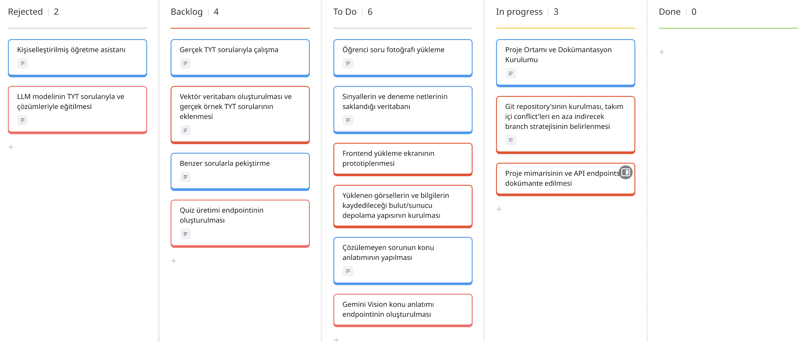


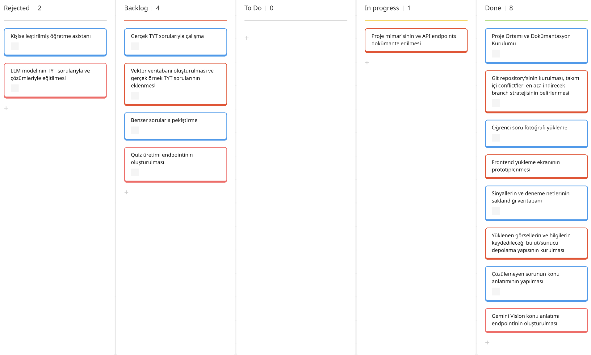

- **Ürün Durumu**: Ekran görüntüleri:

  
  
  
  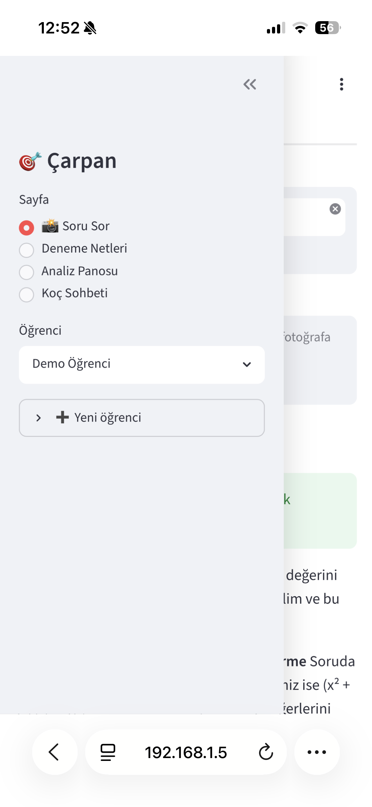
  
  

- **Sprint Review**:
Alınan kararlar: Veritabanı için gerekli olan TYT örnek sorularının toplanması gerekmektedir. Kişiselleştirilmiş öğrenme asistanı için fine-tuning işlemine gerek olmadığına ve aynı sonucun Gemini API ve RAG yöntemiyle ulaşılabileceğine karar verilmiştir.

- **Sprint Retrospective:**
  - Takım içindeki görev dağılımıyla ilgili düzenleme yapılması kararı alınmıştır
  - Makine öğrenmesi modellerinin eğitimiyle ilgili tüm ekip üyelerinin araştırma yapması kararı alınmıştır

---

# Sprint 2

- **Backlog düzeni ve Story seçimleri**: Backlog aynı Miro panosunda yönetilmektedir (kırmızı item = task, mavi item = story). Sprint 2'ye, Sprint 1'de kurulan iskeletin üzerine çekirdek döngüyü kapatan story'ler öncelik sırasına göre alınmıştır. Story'ler yine task'lere bölünmüş ve sahipleri belirlenmiştir.

- **Puan tamamlama mantığı**: Story puanları, işin teknik belirsizliği ve tahmini eforuna göre 2-8 arasında verilmiştir. Sprint kapasitesi 64 puan olarak belirlenmiş, sprint sonunda tüm story'ler tamamlanarak 64 puanın tamamı kapatılmıştır.

- **Sprint Notları**: Sprint hedefi, ürünün çekirdek döngüsünü uçtan uca kapatmak ve kalitesini ölçmekti: soru fotoğrafından adım adım anlatım + otomatik konu etiketi, MEB kazanımına dayalı kaynak gösterimi ve benzer çıkmış soru önerisi, doğrulanmış mini quiz, sentetik öğrenci verisiyle kalibre edilen ustalık modeli, süpervizör agent mimarisi ve haftalık çalışma planı. Sprint başında işler kişi başına görev paketleri halinde dağıtılmış; sprint ortasında kod işbirliği dal + Pull Request + gözden geçirme düzenine geçirilmiştir (PR #1, PR #2). Ayrıntılı uygulama notları: [Sprint 2 detay raporu](ProjectManagement/Sprint2Documents/Takım76-Sprint2-README.md)

- **Takım Değişikliği**: Ece Nur Şahin sprint sonunda bootcamp'ten ayrılmıştır; durum akademiye Scrum Master tarafından bildirilmiştir ve takım 4 kişiyle devam etmektedir. Ayrılan üyenin süreç işleri Görkem'e, arayüz işleri Bahar'a devredilmiştir.

- **Tahmin Edilen Tamamlanacak Puan**: Sprint 2 planı 64 puandır; sprint kapanışında tüm 64 puan tamamlanmıştır.

| Story | Puan | Durum | Katkıda Bulunan |
|---|---|---|---|
| T2 — Kaynaklı anlatım (MEB kazanımı + çıkmış soru önerisi) | 8 | ✅ | Görkem |
| T3 — Doğrulanmış quiz + ustalık güncelleme döngüsü | 8 | ✅ | Görkem |
| T4 — ÖSYM değerlendirme seti + doğruluk raporu | 5 | ✅ | Görkem |
| A3 — Sentetik öğrenci üreteci | 8 | ✅ | Doğa |
| A4 — Ustalık modeli kalibrasyonu | 8 | ✅ | Doğa |
| B2 — Süpervizör agent mimarisi | 5 | ✅ | Emir Arda |
| B3 — Haftalık çalışma planı | 8 | ✅ | Emir Arda |
| D3 — Test kapsamının genişletilmesi (12 → 30 test) | 4 | ✅ | Görkem |
| E2 — Sprint 2 teslim seti | 2 | ✅ | Görkem |
| C2 — Soru sorma mobil deneyim turu + quiz arayüzü | 3 | ✅ | Bahar |
| C3 — Panoda ders bazlı net gidişatı + pano cilası | 5 | ✅ | Bahar |

- **Öne Çıkan Ölçüm**: Otomatik konu etiketleme, 120 gerçek ÖSYM sorusundan (2024-2026 TYT) oluşan elle etiketli sette ölçülmüştür; uyuşmazlık denetimi ve prompt'a eklenen tutarlılık kurallarıyla doğruluk **%76.7 → %80.8 → %83.3** olarak iyileştirilmiştir. Yöntem, sistematik hata analizi ve denetim izleri: [etiketleme doğruluk raporu](docs/etiketleme-dogruluk-raporu.md)

- **Daily Scrum**: Bu sprintte daily ritmi düzenli işlememiş, koordinasyon büyük ölçüde Pull Request açıklamaları ve birebir mesajlaşma üzerinden yürümüştür; bu durum retrospektifte iyileştirme maddesi olarak ele alınmıştır. Sprint boyunca tutulan notların derlemesi: [Sprint 2 Daily Scrum Notları](ProjectManagement/Sprint2Documents/DailyScrumMeetingNotesSprint2.docx)

- **Sprint board update**: Sprint board screenshotları:
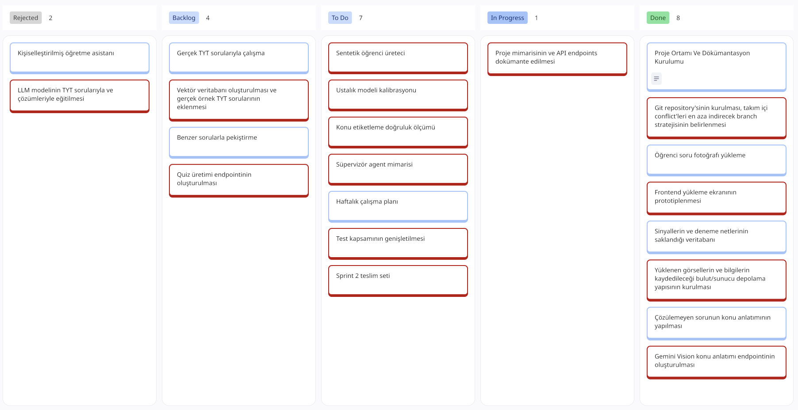
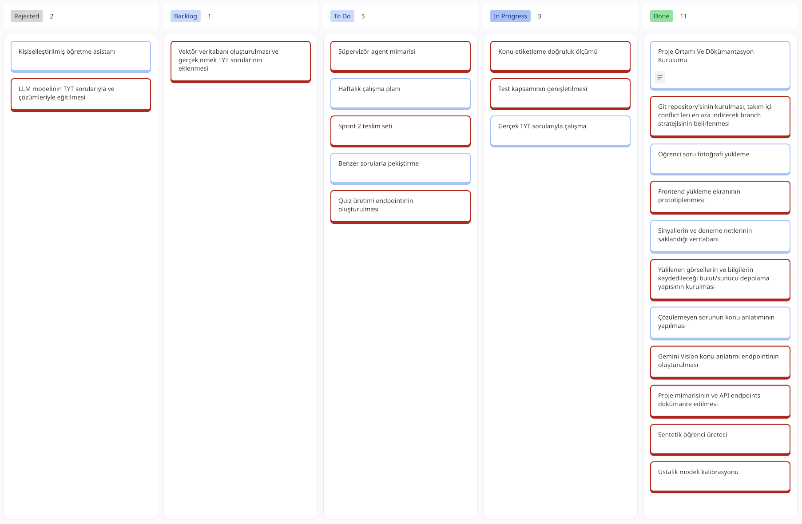


- **Ürün Durumu**: Ekran görüntüleri (soru sorma akışı, deneme neti girişi, konu bazlı renk gradyanlı ustalık haritası, ders bazlı net gidişatı ve haftalık plan). 30 otomatik test + lint her push'ta GitHub Actions üzerinde koşmaktadır.

  
  
  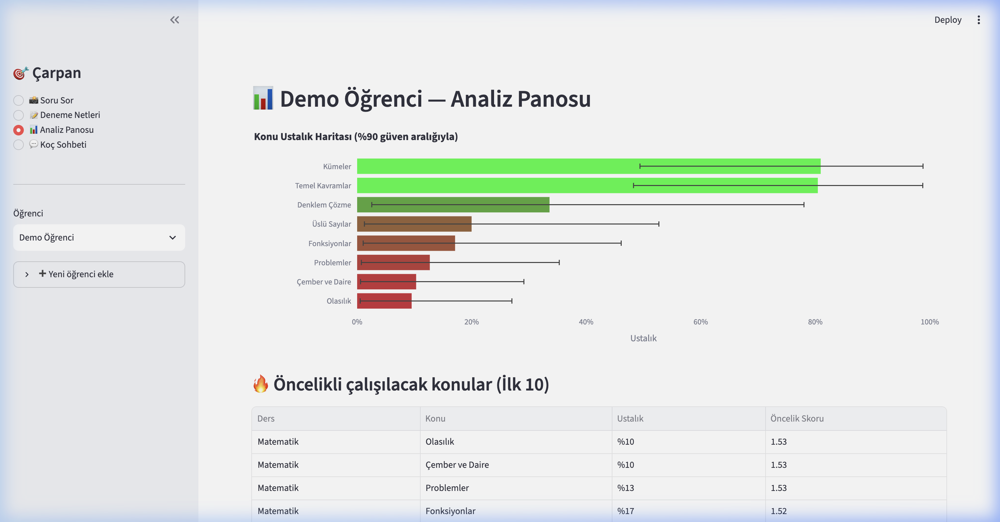
  
  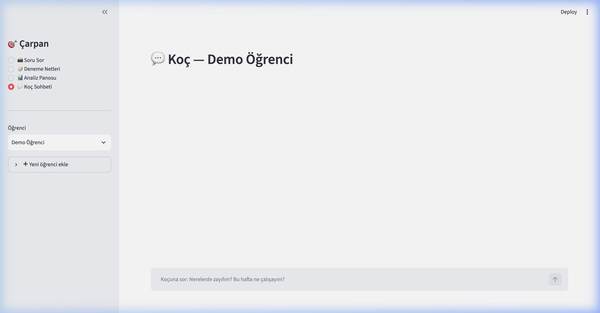

- **Sprint Review**:
Canlı demo: soru fotoğrafı → anlatım → quiz → zayıflık haritasının güncellenişi → koçtan haftalık plan. Doğruluk raporunun sunumu (%83.3) ve Sprint 3 önceliklendirmesi planlanmıştır.
Katılımcılar: Bahar, Görkem, Doğa, Emir Arda
Alınan kararlar: API key olmadan ürünün demo modunda çalışmaya devam etmesi jüri sunumu için kritik olduğu görülmüştür ve fallback mekanizması hayata geçirilmiştir. Subject trend endpoint generic yazıldı — ilerleyen sprintlerde yeni ders eklenmesi halinde kod değişmeyecek.

- **Sprint Retrospective:**
  - Teknik hedeflerin tamamı kapatılmış, ölç → iyileştir → doğrula döngüsü kanıtıyla tamamlanmıştır
  - Dal + Pull Request + gözden geçirme kültürü kurulmuştur; test kapsamı 12'den 30'a çıkmıştır
  - Süreç belgeleri (daily, board) kodun gerisinde kalmıştır; Sprint 3'te board ve daily sorumlusu Bahar olacak, her akşam kısa yazılı daily tutulacaktır
  - Görev sahiplenmedeki boşlukların erken konuşulması kararlaştırılmıştır
  - Streamlit'in mobil deneyimi sınırlı kalmaktadır; Sprint 3'te PWA veya farklı frontend framework değerlendirilebilir

---

# Sprint 3

- **Backlog düzeni ve Story seçimleri**: Backlog aynı Miro panosunda yönetilmektedir (kırmızı item = task, mavi item = story). Final sprinti olduğu için backlog'a kendi modellerimizi eğitme, canlıya alma ve teslim seti story'leri öncelikle alınmış; Sprint 2'den devreden iş bırakılmamıştır.

- **Puan tamamlama mantığı**: Puanlama Sprint 2'deki ölçekle aynı tutulmuştur (2-8 arası). Sprint kapasitesi 58 puan olarak belirlenmiş, sprint sonunda tüm story'ler tamamlanarak 58 puanın tamamı kapatılmıştır.

- **Sprint Notları**: Sprint hedefi, Sprint 2'de kanıtlanan çekirdek döngüyü jüri önünde savunulabilir kılmak ve final teslimi tamamlamaktı: kendi eğittiğimiz konu sınıflandırıcısı (T6), GradientBoosting net tahmin modeli (A5), karne fotoğrafından otomatik net okuma (T5), koç agent kalıcı hafızası (B4) ve eğitim verisi altyapısının tamamlanması. Ayrıntılı uygulama notları: [Sprint 3 detay raporu](ProjectManagement/Sprint3Documents/Takım76-Sprint3-README.md)

- **Tahmin Edilen Tamamlanacak Puan**: Sprint 3 planı 58 puandır; sprint kapanışında tüm 58 puan tamamlanmıştır.

| Story | Puan | Durum | Katkıda Bulunan |
|---|---|---|---|
| T5 — Karne fotoğrafından net okuma | 8 | ✅ | Bahar |
| T6 — Kendi konu sınıflandırıcısını eğit ve karşılaştır | 8 | ✅ | Görkem |
| T7 — Sınıflandırıcıyı `/ask` akışına entegre et | 5 | ✅ | Görkem |
| A5 — GradientBoosting net tahmin modeli | 8 | ✅ | Doğa |
| A6 — Panoda net gidişatı + bir sonraki deneme kestirimi | 3 | ✅ | Doğa |
| B4 — Koç agent kalıcı hafıza (SQLite) | 5 | ✅ | Emir Arda |
| B5 — Agent araç zenginleştirmesi | 3 | ✅ | Emir Arda |
| D4 — Canlı ürün deploymenti | 5 | ✅ | Emir Arda |
| E3 — Sprint 3 teslim seti | 5 | ✅ | Bahar |
| E4 — Daily & board canlı tutma | 3 | ✅ | Bahar |
| Q1 — Eğitim verisi altyapısı (transkripsiyon + üretim) | 5 | ✅ | Görkem |

- **Öne Çıkan Ölçümler**:
  - **Kendi sınıflandırıcımız:** TF-IDF + LogReg modeli aynı 120 soruluk ÖSYM setinde **%58.3** doğruluk; Gemini zero-shot **%83.3**. Fark dürüstçe raporlandı. Asıl değeri: API key olmadan sistem çalışır, milisaniyede sonuç verir. [siniflandirici-karsilastirma.md](docs/siniflandirici-karsilastirma.md)
  - **Net tahmin modeli:** GradientBoosting, sentetik kohortta baseline'ı geçti (**MAE 2.10 vs 3.17, ~%34 iyileşme**). Model sentetik ölçekte eğitildiği için henüz canlı veriye bağlanmadı; panodaki tahmin deneme geçmişinden hesaplanan kestirimdir. [net-tahmin.md](docs/net-tahmin.md)
  - **Kalibrasyon:** Bayesçi ustalık modeli 1000 sentetik öğrenciyle kalibre edildi, MAE 0.1021. [kalibrasyon.md](docs/kalibrasyon.md)
  - **Eğitim verisi:** 317 AI üretimi soru (`data/uretilen_sorular.csv`), 1000 sentetik öğrenci profili (`data/synthetic_students.csv`)

- **Daily Scrum**: Sprint 3'te daily ritmi her akşam yazılı olarak toplanmıştır (Sprint 2 retrosunda söz verilen iyileştirme). Notların derlemesi: [Sprint 3 Daily Scrum Notları](ProjectManagement/Sprint3Documents/DailyScrumMeetingNotesSprint3.md)

- **Sprint board update**: Sprint board screenshotları (sprint başı → orta → kapanış):
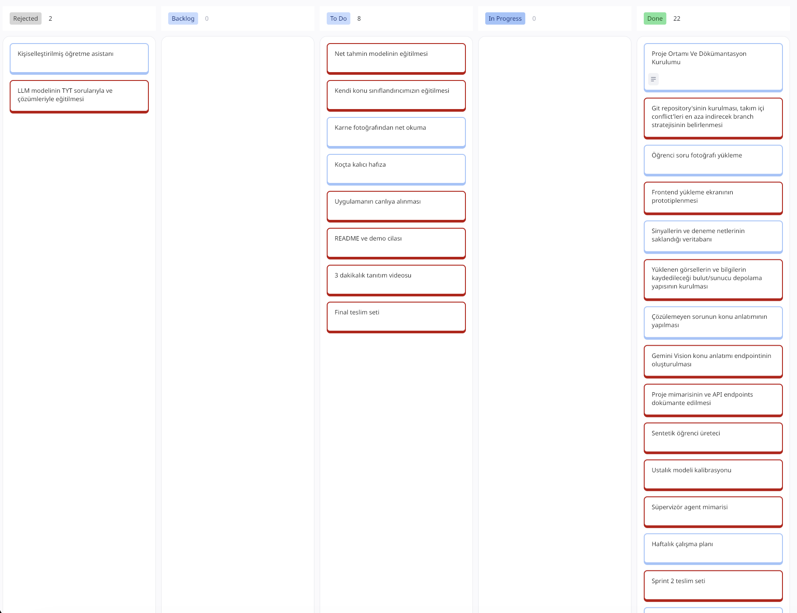
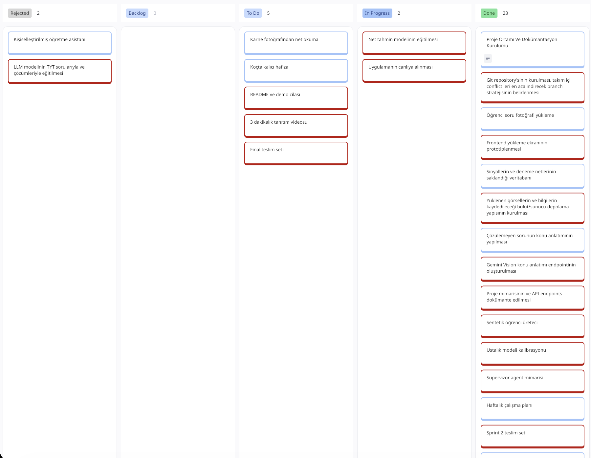
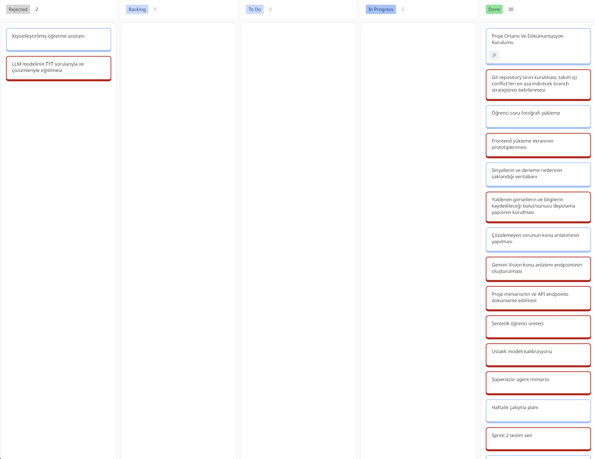

- **Ürün Durumu**: Sprint 3 sonu itibarıyla tüm özellikler entegre ve çalışır durumda: soru fotoğrafından anlatım + otomatik etiketleme (Gemini veya yerel model), karne fotoğrafından net okuma, Bayesçi ustalık haritası + net gidişatı kestirimi, kişisel haftalık plan, LangGraph koç agent (kalıcı hafıza). 38 otomatik test + lint her push'ta GitHub Actions üzerinde koşmaktadır. Aşağıdaki görüntüler **canlı uygulamadan** alınmıştır:

  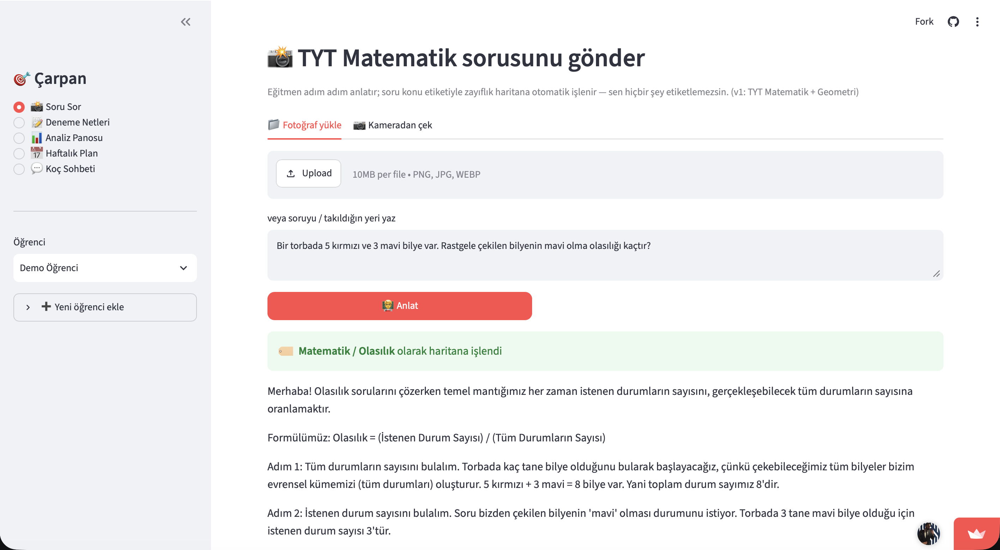
  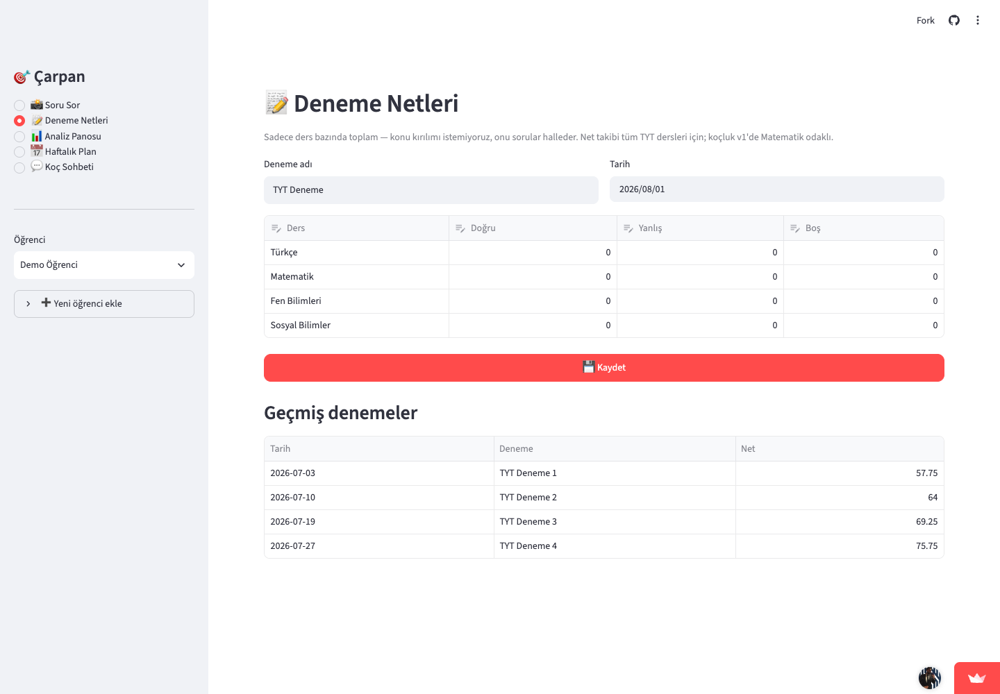
  
  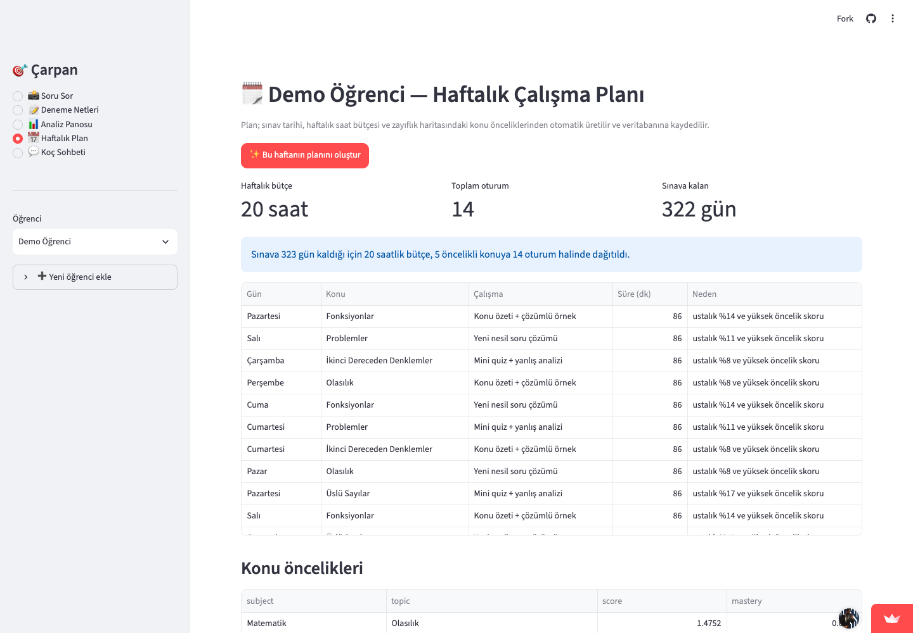
  

- **Sprint Review**:
Sprint kapanışında gözden geçirilenler: canlı üründe uçtan uca akış (soru fotoğrafı → anlatım + otomatik konu etiketi → quiz → ustalık haritası → haftalık plan → koç), karne fotoğrafından net okuma ve model kanıtları (T6 karşılaştırma raporu, A4 kalibrasyon, A5 değerlendirme raporu).
Alınan kararlar: Gemini ile kendi modelimiz arasındaki fark (%83.3 vs %58.3) jüriye dürüstçe sunulacak; anahtarsız demo modu değerlendirme için kritik görülerek korunacak; net tahmin modeli sentetik ölçekte kaldığından ürüne bağlanmadan araştırma çıktısı olarak raporlanacak.

- **Sprint Retrospective:**
  - Teknik hedeflerin tamamı kapatıldı: kendi modellerimiz eğitildi, karşılaştırıldı ve entegre edildi
  - Süreç belgeleri (daily, board) Sprint 2 retrosunda söz verilen düzeye çıkarıldı
  - Eğitim verisi altyapısı sağlamlaştı: transkripsiyon, üretim ve eğitim pipeline'ları scriptlendi
  - Kendi modelimiz %58.3 ile Gemini'yi geçemedi — fark anlaşılır (27 sınıf, ~500 örnek); daha büyük veri ile kapatılabilir (post-bootcamp)
  - Streamlit mobil deneyimi hâlâ sınırlı; sonraki versiyonda PWA değerlendirilebilir

---

# Teknik Bilgiler

## Mimari

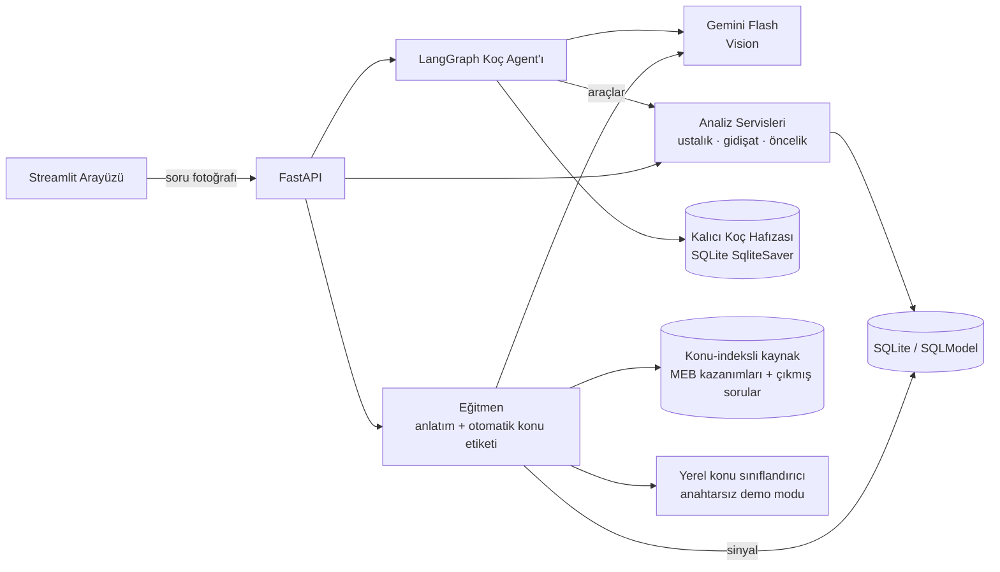
```mermaid
flowchart LR
    UI[Streamlit Arayüzü] -->|soru fotoğrafı| API[FastAPI]
    API --> TUT[Eğitmen<br/>anlatım + otomatik konu etiketi]
    TUT --> LLM[Gemini Flash<br/>Vision]
    TUT -->|sinyal| DB[(SQLite / SQLModel)]
    API --> SVC[Analiz Servisleri<br/>ustalık · gidişat · öncelik]
    SVC --> DB
    API --> AG[LangGraph Koç Agent'ı]
    AG -->|araçlar| SVC
    AG --> MEM[(Kalıcı Koç Hafızası<br/>SQLite SqliteSaver)]
    AG --> LLM
    TUT --> RAG[(Konu-indeksli kaynak<br/>MEB kazanımları + çıkmış sorular)]
    TUT --> CLS[Yerel konu sınıflandırıcı<br/>anahtarsız demo modu]
```

Detay ve rubrik eşlemesi: [docs/mimari.md](docs/mimari.md) · Ürün tanımı: [docs/urun-tanimi.md](docs/urun-tanimi.md)

## Model Kanıtları

| Kanıt | Doğruluk / Metrik | Belge |
|---|---|---|
| Otomatik konu etiketleme (Gemini, 120 ÖSYM sorusu) | **%83.3** | [etiketleme-dogruluk-raporu.md](docs/etiketleme-dogruluk-raporu.md) |
| Kendi konu sınıflandırıcımız (TF-IDF + LogReg) | **%58.3** | [siniflandirici-karsilastirma.md](docs/siniflandirici-karsilastirma.md) |
| Bayesçi ustalık modeli kalibrasyonu (1000 sentetik öğrenci) | MAE **0.1021** | [kalibrasyon.md](docs/kalibrasyon.md) |
| GradientBoosting net tahmin modeli (sentetik kohort) | MAE **2.10** (baseline 3.17, **%34 iyileşme**) | [net-tahmin.md](docs/net-tahmin.md) |

## Kurulum ve Çalıştırma

```bash
# Gereksinim: Python 3.11+
python3 -m venv .venv
source .venv/bin/activate

pip install -r requirements.txt
cp .env.example .env

# .env dosyasına GOOGLE_API_KEY değerini girin.
# GOOGLE_API_KEY=...
# DATABASE_URL=sqlite:///./carpan.db
# COACH_MEMORY_PATH=./data/coach-checkpoints.sqlite3

# Demo verisi (opsiyonel): panoyu dolu görmek için
python backend/scripts/seed_demo.py

# API — http://localhost:8000/docs
uvicorn app.main:app --reload --app-dir backend

# Arayüz — ayrı terminalde http://localhost:8501
streamlit run frontend/streamlit_app.py

# Testler ve lint
pytest backend/tests -q
ruff check backend frontend
```

## Kalıcı Koç Hafızası

Koç konuşmaları LangGraph `SqliteSaver` aracılığıyla SQLite dosyasına kaydedilir; her öğrenci
için ayrı bir konuşma dizisi (`thread_id = student-{id}`) kullanılır. Yerel varsayılan yol
`./data/coach-checkpoints.sqlite3`, canlı ortamda Railway'in kalıcı `/data` volume'üdür.
Böylece uygulama yeniden başlatıldığında öğrenci verileri ve koç konuşmaları korunur.

**Kabul testi:** canlı uygulamada koça bir konu üzerinde çalıştığını söyle → servisi yeniden
başlat → aynı öğrenciyle "dün hangi konuya çalışmıştık?" diye sor → koç hatırlıyorsa test başarılı.

## Canlıya Alma

**Backend — Railway:** başlangıç komutu `railway.json` içinde tanımlıdır
(`uvicorn app.main:app --host 0.0.0.0 --port $PORT --app-dir backend`). Ortam değişkenleri:
`GOOGLE_API_KEY`, `DATABASE_URL=sqlite:////data/carpan.db`,
`COACH_MEMORY_PATH=/data/coach-checkpoints.sqlite3`, `LANGGRAPH_STRICT_MSGPACK=true`,
`RAILPACK_PYTHON_VERSION=3.11`. Kalıcı volume mount yolu: `/data`.

**Arayüz — Streamlit Community Cloud:** giriş dosyası `frontend/streamlit_app.py`,
secret olarak `CARPAN_API_URL` tanımlıdır. `GOOGLE_API_KEY` yalnızca Railway tarafında tutulur,
repoya eklenmez.

## Proje Yönetimi Belgeleri

- **Veri kaynakları ve toplama rehberi:** [docs/veri-kaynaklari.md](docs/veri-kaynaklari.md)
- **Final teslim kontrol listesi:** [docs/teslim-kontrol.md](docs/teslim-kontrol.md)
- **Kabul kontrol listesi:** [docs/acceptance-checklist.md](docs/acceptance-checklist.md)
- **Sprint klasörleri:** [Sprint 1](ProjectManagement/Sprint1Documents/) · [Sprint 2](ProjectManagement/Sprint2Documents/) · [Sprint 3](ProjectManagement/Sprint3Documents/)
