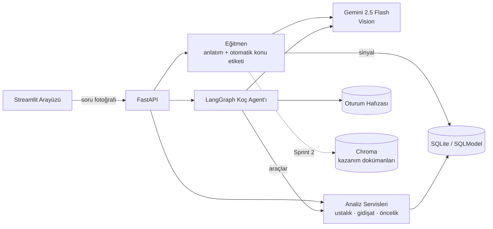

<div align="center">

# 🎯 Çarpan

### TYT Matematik netini yükselten yapay zeka koçu

**Çözemediğin matematik sorusunun fotoğrafını at, anında adım adım anlatım al.** Her sorduğun
soru, yapay zeka tarafından otomatik konu etiketlenir ve zayıflık haritan **kendiliğinden**
oluşur — veri girişi yok, form yok. Harita + deneme netlerinle koçun sana kişisel haftalık
plan çıkarır.

*Önce değer, sonra veri. · v1: TYT Matematik · YZTA Bootcamp 2026 · Yapay Zeka & Veri Bilimi*

</div>

---

## 👥 Takım

| İsim | Rol | GitHub |
|---|---|---|
| Bahar Çakır | Scrum Master · Süreç & Arayüz | [Baharcakir](https://github.com/Baharcakir) |
| Görkem Çetinkaya | Developer · Eğitmen hattı (RAG, quiz, ölçüm) | [gorkem-cetinkaya](https://github.com/gorkem-cetinkaya) |
| Doğa Alışkan | Developer · Modeller & Sentetik Veri | [dogalskn](https://github.com/dogalskn) |
| Emir Arda Tomaç | Product Owner · Agent Mimarisi & Plan | [emirardatomac](https://github.com/emirardatomac) |

**Takım:** Takım 76

## 🧠 Ürün Açıklaması

Soru çözüm uygulamaları soruyu anlatır ama öğrenciyi tanımaz; koçluk hizmetleri öğrenciyi tanır
ama pahalıdır. "Analiz" araçları ise öğrenciden ödev gibi veri girişi ister — kimse girmez.

Çarpan'ın çekirdek döngüsü bu üç problemi birden çözer: öğrenci **takıldığı matematik sorusunun
fotoğrafını atar**, eğitmen yapay zeka **adım adım anlatır** (değer anında verilir) ve aynı anda
soruyu 27 konuluk TYT Matematik taksonomisine göre **otomatik konu etiketleyip** zayıflık sinyali
olarak kaydeder. Sinyaller biriktikçe Bayesçi ustalık haritası, konu öncelikleri ve haftalık plan
kendiliğinden oluşur. Denemelerden yalnızca ders bazında toplam net girilir (4-5 satır, ~10 saniye).

**Anlatım aynı zamanda teşhistir** — analitik, kullanımın yan ürünüdür.

**v1 kapsamı bilinçli olarak TYT Matematik'tir** (en acı nokta, ölçülebilir kalite, 27 konuluk
anlamlı harita); mimari ders-bağımsızdır, taksonomi + korpus ekleyerek genişler. Model eğitim
stratejisi (ÖSYM çıkmış soruları, AI üretimi sorular, sentetik kohortlar): [docs/mimari.md](docs/mimari.md)

Detaylı ürün tanımı: [docs/urun-tanimi.md](docs/urun-tanimi.md)

## ✨ Özellikler

**MVP**
- 📸 Soru fotoğrafı/metni → adım adım anlatım (Gemini Vision) + otomatik konu etiketi
- 🗺️ Kendiliğinden oluşan zayıflık haritası — Bayesçi ustalık skorları, güven aralıklarıyla
- 🔁 Anlatım sonrası mini quiz: doğru cevap ustalığı yukarı günceller (döngü kapanır)
- 📈 Net gidişatı ve gelecek deneme tahmini — GradientBoosting modeli, baseline'ı %34 geçiyor
- 🗓️ Kişiye özel haftalık çalışma planı (sınav tarihi, zaman bütçesi, konu öncelikleri)
- 💬 Öğrenciyi hatırlayan yapay zeka koçu (LangGraph agent + araç kullanımı + kalıcı hafıza)
- 📚 Müfredat kazanımlarına dayalı, kaynak gösteren anlatım (RAG)
- 📷 Deneme karnesi fotoğrafından net okuma (Gemini Vision) — öğrenci hiç veri girmez
- 🤖 Yerel konu sınıflandırıcısı — API key olmadan da çalışır, milisaniyede sonuç

**Stretch / Sonraki**
- ✅ Plan uyum takibi ve otomatik plan revizyonu
- 🌐 TYT Türkçe, Fen Bilimleri konu genişlemesi

## 🎯 Hedef Kitle

- **Birincil:** YKS'ye hazırlanan 11-12. sınıf öğrencileri ve mezunlar; özellikle dershane/koçluk
  hizmetlerine erişimi kısıtlı öğrenciler.
- **İkincil:** Öğrencilerini veriyle takip etmek isteyen öğretmenler ve küçük kurslar (B2B, gelecek aşama).

## 🏗️ Mimari


```mermaid
flowchart LR
    UI[Streamlit Arayüzü] -->|soru fotoğrafı| API[FastAPI]
    API --> TUT[Eğitmen<br/>anlatım + otomatik konu etiketi]
    TUT --> LLM[Gemini 2.5 Flash<br/>Vision]
    TUT -->|sinyal| DB[(SQLite / SQLModel)]
    API --> SVC[Analiz Servisleri<br/>ustalık · gidişat · öncelik]
    SVC --> DB
    API --> AG[LangGraph Koç Agent'ı]
    AG -->|araçlar| SVC
    AG --> MEM[(Oturum Hafızası)]
    AG --> LLM
    TUT -.Sprint 2.-> RAG[(Chroma<br/>kazanım dokümanları)]
```

Detay ve rubrik eşlemesi: [docs/mimari.md](docs/mimari.md)

## 🚀 Kurulum ve Çalıştırma

```bash
# Gereksinim: Python 3.11+
python3 -m venv .venv && source .venv/bin/activate
pip install -r requirements.txt
cp .env.example .env        # GOOGLE_API_KEY girin (soru anlatımı ve koç için)

# Demo verisi (opsiyonel): panoyu dolu görmek için
python backend/scripts/seed_demo.py

# API (http://localhost:8000/docs)
uvicorn app.main:app --reload --app-dir backend

# Arayüz — ayrı terminalde (http://localhost:8501)
streamlit run frontend/streamlit_app.py

# Testler ve lint
pytest backend/tests && ruff check backend frontend
```

## 🗂️ Proje Yönetimi

- **Product Backlog:** [Miro board](https://miro.com/app/board/uXjVH-ttQY8=/?share_link_id=525660778806)
- **Veri kaynakları ve toplama rehberi:** [docs/veri-kaynaklari.md](docs/veri-kaynaklari.md)
- **Final teslim kontrol listesi:** [docs/teslim-kontrol.md](docs/teslim-kontrol.md)
- **Sprint Board:** [Miro board](https://miro.com/app/board/uXjVH-ttQY8=/?share_link_id=525660778806) (kırmızı = task, mavi = story)
- **Daily Scrum:** Her akşam 21:30, 15 dk (WhatsApp/Slack) — notlar sprint klasörlerinde

| Sprint | Tarih | Klasör | Rapor |
|---|---|---|---|
| Sprint 1 | 19 Haziran – 5 Temmuz | [Sprint1](ProjectManagement/Sprint1/) | — |
| Sprint 2 | 6 – 19 Temmuz | [Sprint2](ProjectManagement/Sprint2/) | [Sprint 2 README](ProjectManagement/Sprint2/Takım76-Sprint2-README.md) |
| Sprint 3 | 20 Temmuz – 2 Ağustos | [Sprint3](ProjectManagement/Sprint3/) | [Sprint 3 README](ProjectManagement/Sprint3/Takım76-Sprint3-README.md) |

## 🧪 Model Kanıtları

| Kanıt | Doğruluk / Metrik | Belge |
|---|---|---|
| Otomatik konu etiketleme (Gemini, 120 ÖSYM sorusu) | **%83.3** | [etiketleme-dogruluk-raporu.md](docs/etiketleme-dogruluk-raporu.md) |
| Kendi konu sınıflandırıcımız (TF-IDF + LogReg) | **%58.3** | [siniflandirici-karsilastirma.md](docs/siniflandirici-karsilastirma.md) |
| Bayesçi ustalık modeli kalibrasyonu (1000 sentetik öğrenci) | MAE **0.1021** | [kalibrasyon.md](docs/kalibrasyon.md) |
| GradientBoosting net tahmin modeli | MAE **2.10** (baseline 3.17, **%34 iyileşme**) | [net-tahmin.md](docs/net-tahmin.md) |
