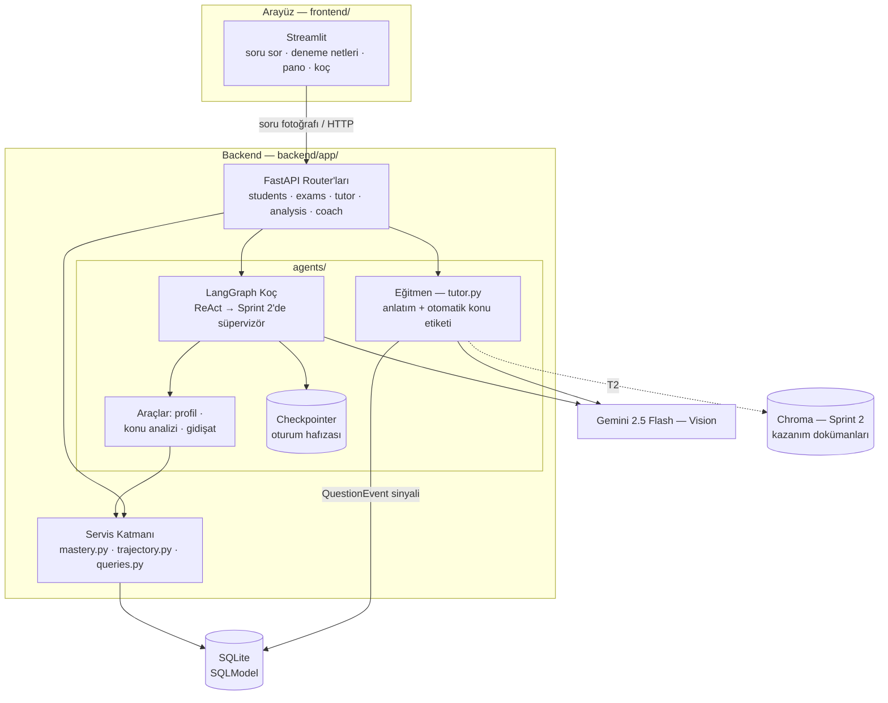
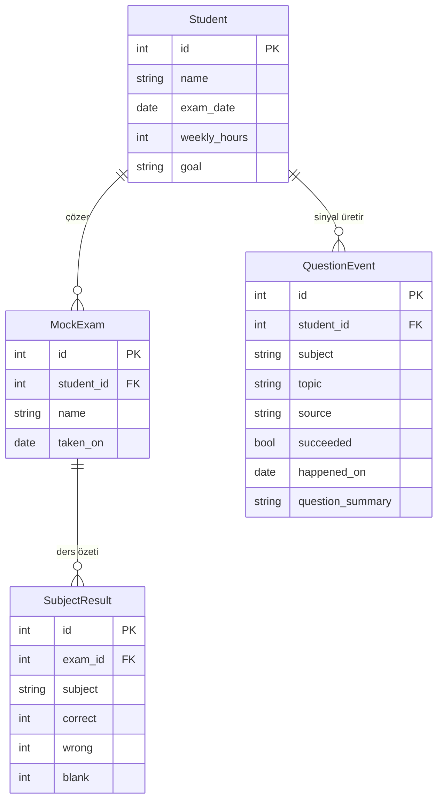

# Çarpan — Mimari

## Genel Bakış

**Çekirdek ilke:** önce değer, sonra veri. Öğrenci konu bazlı veri girmez; çözemediği soruyu
gönderir, anlatım alır. Konu etiketini eğitmen LLM koyar; zayıflık haritası `QuestionEvent`
sinyallerinden kendiliğinden örülür.

## Katmanlar ve Sorumluluklar

| Katman | Klasör | Sorumluluk |
|---|---|---|
| Arayüz | `frontend/` | Sadece sunum; iş mantığı içermez, API'yi çağırır |
| API | `backend/app/routers/` | HTTP sözleşmesi, doğrulama, hata kodları |
| Servis | `backend/app/services/` | Veri bilimi ve iş mantığı — framework'ten bağımsız, birim testli |
| Agent | `backend/app/agents/` | LLM orkestrasyonu; servisleri **araç** olarak kullanır |
| Veri | `backend/app/models.py`, `db.py` | SQLModel şemaları, oturum yönetimi |

Kural: **agent'lar veritabanına doğrudan değil, servis araçları üzerinden erişir.** Böylece aynı
mantık hem API'den hem koçtan tutarlı çalışır ve ayrı ayrı test edilir.

## Veri Modeli

- **`QuestionEvent` ürünün çekirdek verisidir:** soru soruldu (photo_ask, başarısız sayılır),
  "takıldım" işareti (manual) veya quiz cevabı (quiz, başarılı/başarısız). Konu etiketi her zaman
  yapay zekadan gelir.
- **`SubjectResult` bilerek kabadır:** deneme başına ders bazında 4-5 satır; yalnızca net
  gidişatını besler. Konu kırılımı kullanıcıdan asla istenmez.

## Yapay Zeka Bileşenleri

1. **Eğitmen (`agents/tutor.py`)** — Gemini Vision: soru fotoğrafını/metnini adım adım anlatır ve
   TYT taksonomisine göre otomatik ders/konu etiketler (yapılandırılmış JSON çıktı). Her çağrı bir
   `QuestionEvent` düşürür — anlatım aynı zamanda teşhistir. T2'de RAG'le, T4'te etiket doğruluğu
   değerlendirme setiyle güçlenecek.
2. **Ustalık modeli (`services/mastery.py`)** — Beta-Binomial Bayesçi kestirim: az sinyalde geniş
   güven aralığı (yanıltıcı kesinlik yok), 30 gün yarı ömürlü unutma ağırlığı, şans düzeltmesi.
   Girdi: QuestionEvent sinyalleri (soruldu=başarısızlık, quiz doğrusu=başarı). Öncelik skoru =
   konunun sınav ağırlığı × (1 − kötümser ustalık). A4'te sinyal ağırlıkları kalibre edilecek.
3. **Gidişat modeli (`services/trajectory.py`)** — v0: doğrusal eğilim; Sprint 3'te (A5) sentetik
   kohortla eğitilmiş GBM regresyonuna yükseltilecek ve raporla karşılaştırılacak.
4. **Koç agent'ı (`agents/graph.py`)** — LangGraph ReAct: Gemini araç çağrılarıyla analiz çeker,
   veri yokken yorum uydurmaz. Sprint 2'de (B2) süpervizör mimarisine ayrışacak. Hafıza: thread
   bazlı checkpointer (B5'te kalıcı SQLite + profil özeti).
5. **RAG (Sprint 2, T2)** — MEB/ÖSYM kazanım dokümanları Chroma'da; eğitmen kaynak göstererek anlatır.

## Veri ve Model Eğitim Stratejisi

Sık sorulan soru: *"Modeli ÖSYM'nin çıkmış sorularıyla ve AI üretimi sorularla eğitecek miyiz?"*
Cevap, "model" kelimesini doğru yere koymaktan geçer — sistemde dört model bileşeni var ve her
birinin veriyle ilişkisi farklı:

| Bileşen | Eğitilir mi? | Veri kaynağı |
|---|---|---|
| Gemini (anlatım, etiketleme, quiz üretimi) | **Hayır** — API'den kullanılır | Prompt + RAG ile yönlendirilir |
| Konu sınıflandırıcı (T6) | **Evet** — kendimiz eğitiriz | Etiketli ÖSYM çıkmış soruları + doğrulanmış AI üretimi sorular |
| Ustalık modeli (Bayesçi) | Eğitilmez, **kalibre edilir** (A4) | Sentetik öğrenci kohortları (A3) |
| Net tahmin modeli (A5) | **Evet** — kendimiz eğitiriz | Sentetik öğrenci kohortları (A3) |

**Gemini'yi neden eğitmiyoruz (fine-tune yok):** TYT matematiğini zaten çözüyor; fine-tune
maliyet ve karmaşıklık getirir, bootcamp süresinde ölçülebilir kazanımı belirsizdir. LLM'in gücünü
prompt mühendisliği + RAG ile yönlendirmek, gücümüzü ise *kendi* modellerimize harcamak doğru
kaynak dağılımıdır.

**Dört veri kaynağı, kullanım yerleri:**

1. **ÖSYM çıkmış TYT Matematik soruları** (kamuya açık yayımlanır):
   - **T4 — değerlendirme seti:** ~100 soru elle etiketlenir; otomatik etiketlemenin doğruluğu
     bu sette **ölçülür** (eğitim değil, sınav). Jüriye sunulacak temel veri bilimi kanıtı.
   - **T2 — RAG korpusu:** anlatımın gerçek sınav diline oturması + "bu konudan çıkmış benzer
     soru" önerisi.
   - **T6 — eğitim verisi:** kendi konu sınıflandırıcımızın etiketli örnekleri.
   - *Telif notu:* ÖSYM soruları kamuya açıktır; kaynak belirtilir, toplu yeniden yayım
     yapılmaz. Yayınevi (telifli) soruları kullanılmaz.
2. **AI üretimi sorular** (Gemini üretir, çıkmış sorular stil çapası olur):
   - **T3 — quiz bankası:** üretilen her soru bağımsız ikinci bir çözümle doğrulanır (cevap
     tutarlılığı testi); tutarsızlar elenir, örneklem insan gözüyle denetlenir.
   - **T6 — veri büyütme:** az örnekli konularda sınıflandırıcı eğitim setini dengeler.
3. **Sentetik öğrenci kohortları (A3):** "şu konuları şu düzeyde bilen öğrenci" profillerinden
   sinyal/deneme üretimi. Ustalık modelinin kalibrasyonu (A4) ve net tahmin modelinin eğitimi
   (A5) bunlarla yapılır. Gerçek öğrenci davranış verimiz yok — bunu gizlemeyiz, README'de
   açıkça "sentetik veriyle eğitildi/kalibre edildi" deriz; ölçüm metodolojisi raporlanır.
4. **Gerçek kullanım sinyalleri (QuestionEvent):** hiçbir modeli eğitmez; öğrenci başına Bayesçi
   çıkarımı besler (kişiselleştirme çevrimiçi çıkarımla olur, yeniden eğitimle değil).

**T6'nın hikayesi (jüri için):** "Konu etiketlemeyi önce Gemini zero-shot ile yaptık, doğruluğunu
gerçek ÖSYM sorularında ölçtük (T4). Sonra kendi sınıflandırıcımızı eğitip (embedding + klasik ML)
aynı sette karşılaştırdık; kazananı üretime koyduk. Kendi modelimiz ayrıca daha hızlı ve ucuz."
Bu, rubrikteki "model seçimi, kullanımı, geliştirmesi" kaleminin tam karşılığıdır.

### Veri Protokolü — Demir Kurallar (T4/T6 çalışanı buna uyar)

1. **Değerlendirme seti dokunulmazdır ve %100 gerçek ÖSYM sorusudur.** AI üretimi soru
   değerlendirme setine ASLA girmez (kendi ödevini kendine puanlatmak olur); yalnızca eğitim
   setine ve quiz bankasına girer. Umursadığımız dağılım gerçek sınav dağılımıdır.
2. **Değerlendirme seti elle ve çift etiketlenir.** İki kişi bağımsız etiketler, anlaşmazlığı
   üçüncü kişi çözer; anlaşma oranı (inter-annotator agreement) raporlanır.
3. **Eğitim etiketleri yarı otomatik olabilir:** Gemini önerir, insan hızlıca onaylar. Ama
   değerlendirme seti elle kalır — yoksa "Gemini'nin etiketlerine göre Gemini'yi ölçme"
   döngüselliğine düşülür ve karşılaştırma anlamını yitirir.
4. **Veri bütçesi (gerçekçi):** ÖSYM ~8 yılda ~320 gerçek TYT matematik sorusu yayımladı →
   ~100 değerlendirme (dokunulmaz) + ~220 eğitim; 27 konuda az örnekli sınıflar AI üretimi
   sorularla dengelenir. Kendi modelimiz Gemini'yi geçemeyebilir — sonuç yine de geçerlidir:
   "ölçtük, veriye dayanarak seçtik" raporu deliverable'dır, kazanan üretime girer.

## Değerlendirme Rubriği Eşlemesi

| Rubrik kalemi (puan) | Çarpan'daki karşılığı |
|---|---|
| YZ modeli seçimi/kullanımı/geliştirmesi (20) | Üç kendi model bileşenimiz: eğitilmiş konu sınıflandırıcı (T6, Gemini ile karşılaştırmalı), kalibre edilmiş Bayesçi ustalık modeli (A4), eğitilmiş net tahmin modeli (A5) + Gemini Vision entegrasyonu; tüm doğruluk/kalibrasyon raporları repoda |
| AI agent, hafıza, orkestrasyon (15) | LangGraph çok-agent süpervizör mimarisi (koç + eğitmen + planlayıcı), araç kullanımı, thread hafızası + kalıcı profil |
| Mimari ve temiz kod (15) | Katmanlı yapı, servislerin framework bağımsızlığı, CI (ruff+pytest), tip ipuçları |
| Canlıya alınabilirlik (10) | 12-factor config (.env), SQLite→Postgres geçiş yolu, D4'te canlı deploy |

## Teknoloji Gerekçeleri

- **FastAPI + SQLModel:** hızlı, tipli, otomatik OpenAPI dokümantasyonu (`/docs` jüri demosunda etkili).
- **Gemini 2.5 Flash:** ücretsiz kota + hız; vision desteği C6 (OCR) stretch'ini de karşılıyor.
- **LangGraph:** durum makinesi + checkpointer hafıza; süpervizör desenine doğal geçiş.
- **SQLite → Postgres:** MVP'de sıfır kurulum; `DATABASE_URL` ile canlıda Postgres'e geçilebilir.
- **Streamlit:** 5 kişilik AI/DS ekibinin gücünü modele harcaması için en hızlı arayüz; Sprint 3'te
  vakit kalırsa tema ile cilalanır.
